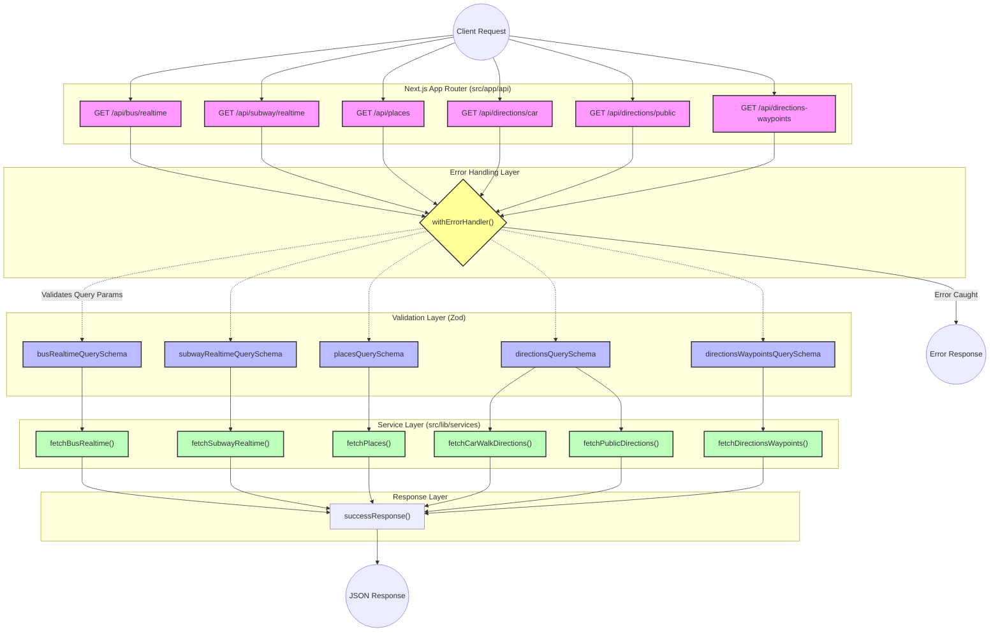

# API Router Flow

다음은 현재 프로젝트의 `src/app/api` 내 라우트들이 요청을 처리하는 흐름을 보여주는 시각화 다이어그램입니다.

## 주요 처리 단계

1. **라우팅 (Routing):** `src/app/api` 폴더 기반의 Next.js App Router가 클라이언트의 `GET` 요청을 각 도메인(Bus, Subway, Places, Directions 등)에 맞게 수신합니다.
2. **에러 핸들링 (Error Handling Layer):** 모든 API 엔드포인트는 `@/lib/apiResponse`의 `withErrorHandler` 래퍼로 감싸져 있어, 내부 로직(검증 및 비즈니스 로직)에서 발생하는 에러를 일괄적으로 처리하고 일관된 에러 응답을 반환합니다.
3. **데이터 검증 (Validation Layer):** 각 요청의 URL 쿼리 파라미터는 `@/lib/validations` 내의 Zod 스키마를 통해 안전하게 파싱 및 검증됩니다. 
4. **비즈니스 로직 (Service Layer):** 검증이 완료된 데이터는 `@/lib/services` 폴더에 있는 각각의 서비스 함수로 전달되어 외부 API 호출이나 내부 연산을 수행합니다.
5. **응답 (Response Layer):** 로직이 정상적으로 완료되면 `successResponse()`를 통해 일관된 JSON 포맷으로 클라이언트에게 결과가 반환됩니다.
