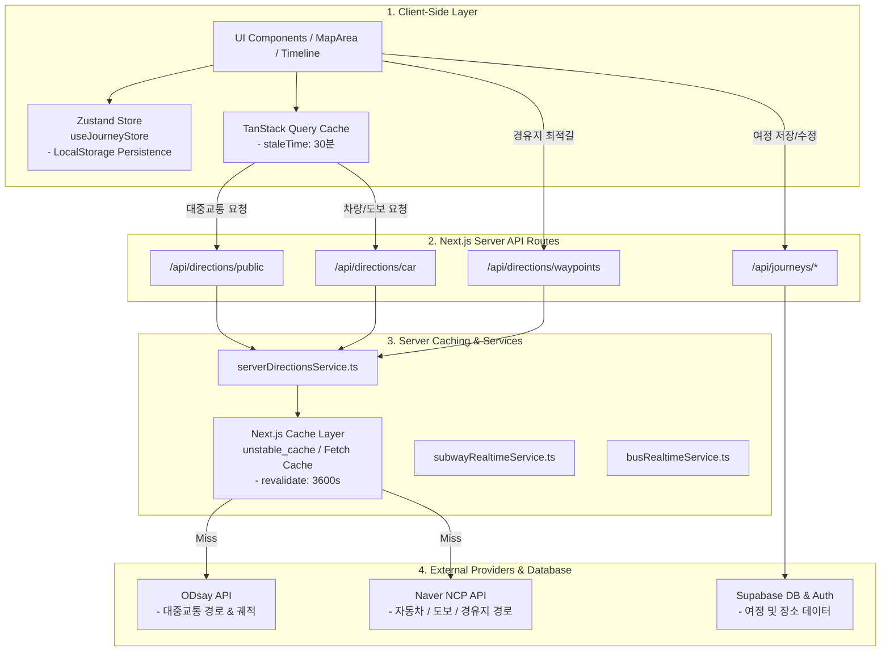
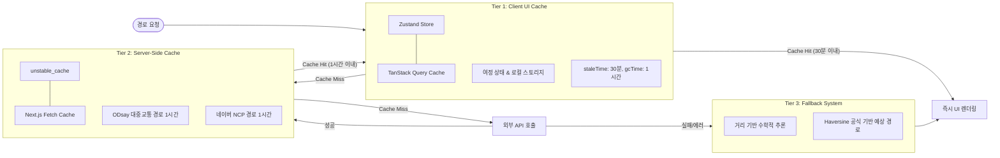
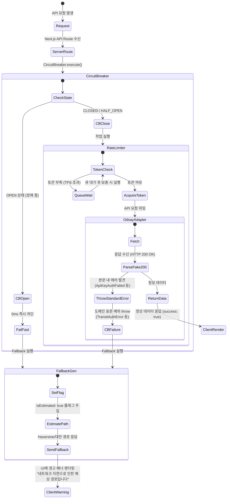

# OnJourney 전체 API 호출 및 캐싱 아키텍처

OnJourney 애플리케이션의 **클라이언트(React/Zustand/TanStack Query) $\rightarrow$ 서버(Next.js App Router) $\rightarrow$ 외부 서비스(ODsay, Naver NCP, Supabase)** 간의 전체 API 통합 체계 및 3단계 캐시 계층 시스템입니다.

---

## 1. 전체 서비스 API 및 계층 구조

---

## 2. 3단계 캐시 계층 (3-Tier Caching System)

OnJourney는 외부 API 호출 비용 절감 및 빠른 UI 반응속도를 보장하기 위해 **3단계 다중 캐시**를 구성하고 있습니다.

---

## 3. 기능별 API 호출 및 캐싱 명세표

| 기능 | 클라이언트 API / 훅 | 서버 라우트 / 서비스 | 캐시 수단 & 유효기간 (`TTL`) | 주요 제공자 | 실패 시 예외 처리 |
|---|---|---|---|---|---|
| **대중교통 경로** | `useSegmentDirection` `fetchPublicDirectionsApi` | `/api/directions/public` `serverDirectionsService.ts` | **Client**: TanStack Query (30분) **Server**: `unstable_cache` (1시간) | ODsay API | Fallback 대중교통 경로 (Haversine 1.3배 추산) |
| **차량 / 도보 경로** | `useSegmentDirection` `fetchCarWalkDirectionsApi` | `/api/directions/car` `serverDirectionsService.ts` | **Client**: TanStack Query (30분) **Server**: `fetch` revalidate (1시간) | Naver NCP Driving v1 | Fallback 차량/도보 경로 추산 |
| **경유지 최적 경로** | `useDirectionsWaypoints` | `/api/directions/waypoints` `directionsWaypointsService.ts` | **Server**: `fetch` revalidate (1시간) | Naver NCP Driving v1 | 에러 메시지 반환 및 기본 직렬 연결 |
| **실시간 버스 / 지하철** | `useRealtimeTransit` | `subwayService.ts` `busRealtimeService.ts` | **No Cache** (실시간 조회) | ODsay / 서울 열린데이터 | 수동 새로고침 안내 |
| **여정 CRUD** | `useJourneys` | `/api/journeys/*` `journeys.ts` | **Client**: Zustand + LocalStorage | Supabase | 로컬 스토리지 임시 보존 |

---

## 4. API 에러 핸들링 & Fallback 메커니즘

---

## 5. 캐시 정밀도(Rounding) 및 TTL 가이드 & 무효화 전략

### 5.1. 캐시 파편화 방지 (좌표 정규화)
- **정밀도 설정**: 요청 위도 및 경도 좌표를 **소수점 4자리로 반올림(Rounding)**하여 캐시 키를 생성합니다.
  - 소수점 4자리는 약 **11m** 수준의 정밀도를 나타내며, 미세한 GPS 오차 및 클라이언트 지도 이동으로 인한 캐시 파편화를 방지하고 히트율(Hit Rate)을 극대화합니다.
- **적용 대상**:
  - `fetchPublicTransitOptions` (ODsay API 호출 키)
  - `fetchCarRoute` (Naver NCP API 호출 URL)
  - `fetchCarWalkDirections` (서버 캐시 파라미터)

### 5.2. 클라이언트와 서버 간의 이상적인 TTL 가이드
데이터 정합성과 서버 부하 최소화를 만족하기 위한 최적의 캐시 수명(TTL) 구성은 다음과 같습니다.

| 계층 | 설정명 | 권장 시간 | 이유 |
|---|---|---|---|
| **서버 캐시 (Next.js Cache / unstable_cache)** | `revalidate` | **1시간 (`3600초`)** | 교통 노선 정보나 도로망 구조는 자주 변하지 않으나, 대중교통 배차 정보 및 실시간 차량 정체를 주기적으로 갱신하기에 적절한 타협점입니다. |
| **클라이언트 (TanStack Query)** | `staleTime` | **30분 (`1800000ms`)** | 동일 사용자가 단기간 내 지도를 이동하거나 탭을 전환할 때 무분별하게 서버에 중복 요청을 보내는 것을 차단합니다. (서버 TTL의 1/2 수준으로 신선도 보완) |
| **클라이언트 (TanStack Query)** | `gcTime` | **1시간 (`3600000ms`)** | 서버 캐시의 데이터 보존 만료 시간과 맞춰 불필요한 메모리 점유를 정리하고 리소스를 동기화합니다. |

### 5.3. 캐시 무효화 및 예외 우회 전략
- **영구 에러 (NoRouteFound 등)**: 정상적인 탐색 결과가 없는 에러는 `{ ok: false, error: ... }` 결과 상태 그대로 **캐시에 1시간 저장**하여 존재하지 않는 경로를 지속적으로 요청하는 쿼리 어뷰징을 방지합니다.
- **일시 에러 (5xx, 429, API Key 오류, Circuit Open)**: 일시적 오류 발생 시에는 캐시 콜백 내부에서 **예외(Exception)를 throw**하게 함으로써 Next.js `unstable_cache`가 이를 캐시하지 않고 무시하도록 설계합니다. 따라서 다음 요청 시 즉시 API 재호출이 시도될 수 있습니다.

