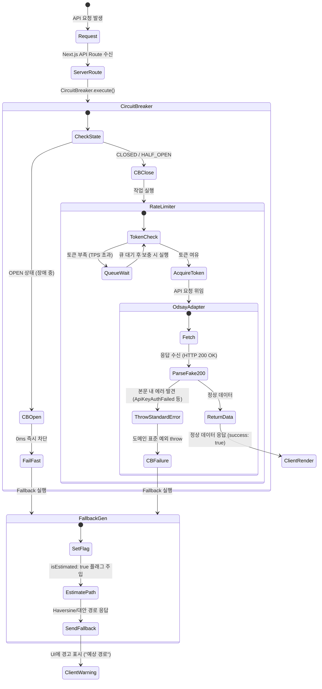

# OnJourney 전체 API 호출 및 캐싱 아키텍처

OnJourney 애플리케이션의 **클라이언트(React/Zustand/TanStack Query) $\rightarrow$ 서버(Next.js App Router) $\rightarrow$ 외부 서비스(ODsay, Naver NCP, 서울시 열린데이터, TAGO, Supabase)** 간의 전체 API 통합 체계 및 다층 캐시 계층 시스템입니다.

---

## 1. 전체 서비스 API 및 계층 구조

```mermaid
graph TD
    subgraph Layer1 [1. Client-Side Layer]
        UI[UI Components / MapArea / Timeline]
        Zustand[Zustand Store<br/>useJourneyStore<br/>- LocalStorage Persistence]
        RQ[TanStack Query Cache<br/>- idb-keyval IndexedDB 영속화<br/>- staleTime: 30분, gcTime: 1시간]
    end

    subgraph Layer2 [2. Next.js Server API Routes]
        PublicRoute["/api/directions/public"]
        CarRoute["/api/directions/car"]
        WalkDetailRoute["/api/directions/walk-detail"]
        WaypointsRoute["/api/directions-waypoints"]
        SubwayRoutes["/api/subway/* (realtime / positions / total)"]
        BusRoutes["/api/bus/* & /api/realtime/bus/*"]
    end

    subgraph Layer3 [3. Server Caching & Services]
        ServerCache["Next.js Cache Layer<br/>unstable_cache / Fetch Cache<br/>- 동적 TTL: 낮 4h / 밤 30m / 대중교통 1h"]
        MemoryCache["In-Memory & Persistent Cache<br/>- LruTtlCache (정류소/노선 메타)<br/>- subwayCacheService (15s 워커 공유)<br/>- busRoutePersistentCache (30일 파일)"]
        DirectionsOrch["directionsOrchestrator.ts"]
        PublicService["publicTransitService.ts"]
        WalkService["odsayWalkingService.ts"]
        SubwayService["subwayTotalRealtimeService.ts"]
        BusService["busRealtimeService.ts / TagoBusService.ts"]
    end

    subgraph Layer4 [4. External Providers & Database]
        ODsay["ODsay API<br/>- 대중교통 경로 & ODsay maasRP 도보 궤적"]
        NaverNCP["Naver NCP API<br/>- 자동차 실시간 경로 Directions 5"]
        OpenData["공공 데이터 API<br/>- 서울시 지하철 열차위치 & TAGO 버스"]
        Supabase["Supabase DB & Auth<br/>- 여정 및 장소 데이터"]
    end

    UI --> Zustand
    UI --> RQ
    RQ -->|대중교통 요청| PublicRoute
    RQ -->|차량/도보 요청| CarRoute
    RQ -->|도보 상세 선형 요청| WalkDetailRoute
    UI -->|경유지 최적길| WaypointsRoute
    UI -->|실시간 지하철| SubwayRoutes
    UI -->|실시간 버스| BusRoutes
    UI -->|여정 직접 동기화 (RLS)| Supabase

    PublicRoute --> PublicService
    CarRoute --> DirectionsOrch
    WalkDetailRoute --> WalkService
    WaypointsRoute --> DirectionsOrch
    SubwayRoutes --> SubwayService
    BusRoutes --> BusService

    PublicService --> ServerCache
    DirectionsOrch --> ServerCache
    WalkService --> ServerCache
    SubwayService --> MemoryCache
    BusService --> MemoryCache

    ServerCache -->|Miss| ODsay
    ServerCache -->|Miss| NaverNCP
    MemoryCache -->|Miss| OpenData
```

---

## 2. 3단계 다중 캐시 계층 (3-Tier Caching System)

외부 API 비용 절감, TPS 한도(ODsay 1,000회/일 등) 보호, 그리고 빠른 사용자 반응속도를 위해 **클라이언트 - 서버 - 인메모리/영속 캐시**의 3단계 계층을 구성하고 있습니다.

```mermaid
flowchart LR
    subgraph L1 [Tier 1: Client UI Cache]
        direction TB
        C1[Zustand Store] --- C2[TanStack Query Cache]
        C1Note[여정 상태 & LocalStorage]
        C2Note[IndexedDB 영속화<br/>staleTime: 30분, gcTime: 1시간]
    end

    subgraph L2 [Tier 2: Server-Side Cache]
        direction TB
        S1[unstable_cache] --- S2[Next.js Fetch Cache] --- S3[LruTtlCache & File Cache]
        S1Note[ODsay 대중교통/도보 1시간<br/>(3시간 버킷 그룹 키)]
        S2Note[네이버 NCP 차량 경로<br/>(낮 4시간 / 밤 30분 동적 TTL)]
        S3Note[지하철 15초 워커 공유<br/>버스 노선 30일 파일 영속]
    end

    subgraph L3 [Tier 3: Fallback System]
        F1[수학적 기하 추론 & 안전 모드]
        F1Note[Haversine 공식 기반 예상 경로<br/>isEstimated: true 플래그]
    end

    Request([경로/교통 요청]) --> L1
    L1 -- Cache Hit (30분 이내) --> Render[즉시 UI 렌더링]
    L1 -- Cache Miss --> L2
    L2 -- Cache Hit --> L1
    L2 -- Cache Miss --> External[외부 API 호출]
    External -- 장애 / Quota 초과 --> L3 --> Render
    External -- 성공 --> L2
```

---

## 3. 기능별 API 호출 및 캐싱 명세표

| 기능 | 클라이언트 API / 훅 | 서버 라우트 / 서비스 | 캐시 수단 & 유효기간 (`TTL`) | 주요 제공자 | 실패 시 예외 처리 |
|---|---|---|---|---|---|
| **대중교통 경로** | `useSegmentDirection`<br/>`fetchPublicDirectionsApi` | `/api/directions/public`<br/>`publicTransitService.ts` | **Client**: TanStack Query (30분)<br/>**Server**: `unstable_cache` (1시간, 3시간 버킷 키) | ODsay API (maasRP) | Circuit Breaker ➡️ Fallback 대중교통 경로 |
| **차량 경로** | `useSegmentDirection`<br/>`fetchCarWalkDirectionsApi` | `/api/directions/car`<br/>`carRouteService.ts` | **Client**: TanStack Query (30분)<br/>**Server**: `fetch` revalidate (낮 4h / 밤 30m 동적 TTL) | Naver NCP Driving v1 | Fallback 차량 경로 추산 (`calculateCarFallback`) |
| **도보 상세 경로** | `useAlternativeRoutes`<br/>`fetchWalkDetailRouteApi` | `/api/directions/walk-detail`<br/>`odsayWalkingService.ts` | **Client**: TanStack Query (30분)<br/>**Server**: `unstable_cache` (1시간) | ODsay maasRP | Fallback 도보 경로 (`walkFallbackService.ts`) |
| **경유지 최적 경로** | `useDirectionsWaypoints` | `/api/directions-waypoints`<br/>`directionsWaypointsService.ts` | **Server**: `fetch` revalidate (1시간) | Naver NCP Driving v1 | 기본 직렬 연결 및 에러 메시지 반환 |
| **실시간 지하철** | `useRealtimeTransit`<br/>`useSubwayLinePositions` | `/api/subway/*`<br/>`subwayCacheService.ts` | **Server**: `unstable_cache` (**15초 TTL** 워커 공유) | 서울시 열린데이터광장 | 직전 스냅샷 메모리 반환 (`lastKnownPositionsMap`) |
| **실시간 버스** | `useRealtimeTransit`<br/>`useBusLinePositions` | `/api/bus/*`<br/>`busPositionService.ts` | **Memory**: `LruTtlCache` (노선/위치 인메모리)<br/>**Disk**: `busRoutePersistentCache.ts` (30일 파일) | TAGO / 경기도 / 부산 / 인천 / 대전 API | 타 지역 API 이중 조회 및 캐시 데이터 반환 |
| **장소 검색** | `usePlaceSearch` | `/api/places`<br/>`placesService.ts` | **Client**: 300ms 디바운스<br/>**Server**: `unstable_cache` (인기도 카운트 캐시) | 카카오 로컬 API | 빈 결과 반환 |
| **여정 CRUD** | `useJourneys`<br/>`useJourney` | Supabase SDK 직접 연동<br/>`src/lib/journeys/index.ts` | **Client**: TanStack Query + Zustand (LocalStorage) | Supabase (RLS) | 로컬 스토리지 임시 보존 |

---

## 4. API 에러 핸들링 & Fallback 메커니즘



---

## 5. 캐시 정밀도(Rounding) 및 TTL 전략

### 5.1. 캐시 파편화 방지 및 좌표 정밀도
- **대중교통 (ODsay)**:
  - 위도 및 경도 좌표를 **소수점 4자리 반올림(`toFixed(4)`)**(약 11m 반경)으로 정규화합니다.
  - `toKstCacheKeyGroup(departureTime)`을 통해 **KST 기준 3시간 단위 버킷 그룹 키(`yyyyMMdd_gN`)**로 묶어 분 단위 캐시 파편화를 방지합니다.
- **차량 경로 (Naver NCP)**:
  - 교차로, 진출입로 등 실제 정밀 도로망 안내를 위해 좌표를 **소수점 6자리(`roundCoord(val, 6)`)**(약 0.1m 정밀도)로 유지합니다.

### 5.2. 시간대별 동적 TTL 전략 (`timeUtils.ts`)
- **차량 경로 (`getCacheDuration`)**:
  - **낮 시간대 (06:00 ~ 23:00)**: **4시간 (`14400초`)** — 도로망과 주요 교통 흐름의 안정적 재사용
  - **밤 시간대 (23:00 ~ 06:00)**: **30분 (`1800초`)** — 심야 도로 공사 및 교통 변화 반영
- **대중교통 경로**:
  - `revalidate: 3600` (**1시간**) 고정 + 3시간 시간 버킷 결합
- **지하철/버스 실시간 데이터**:
  - 지하철 도착/열차 위치: `revalidate: 15` (**15초**) 워커 공유 캐시
  - 버스 정류소 노선 목록: 정적 인프라 데이터이므로 **30일 로컬 파일시스템 영속 캐시**

### 5.3. 캐시 무효화 및 에러 우회 전략
- **온디맨드 재검증 API**: `/api/admin/revalidate`를 통해 관리자 키(`ADMIN_SECRET_KEY`) 인증 후 Next.js 태그 기반 캐시를 즉시 수동 무효화할 수 있습니다.
- **일시 에러 (5xx, 429, API Key 오류, Circuit Open)**: 일시적 오류 발생 시 캐시 내부에서 예외를 throw하여 `unstable_cache`가 실패 결과를 영구 캐싱하지 않도록 방지합니다.
