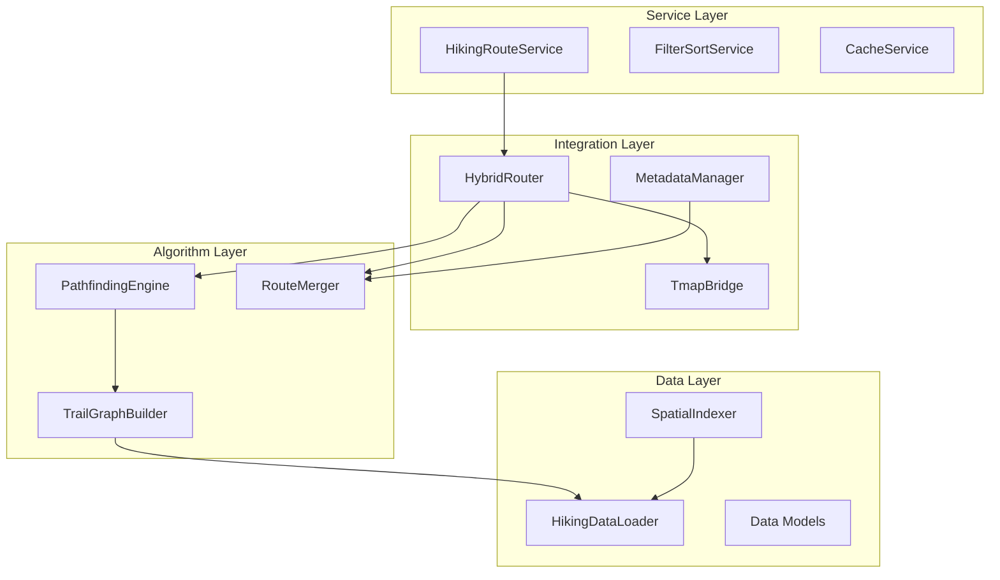
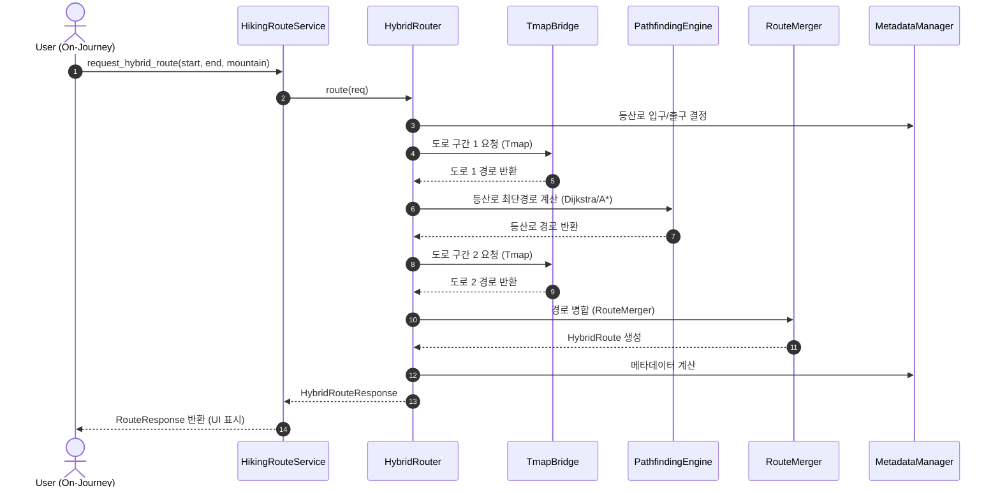
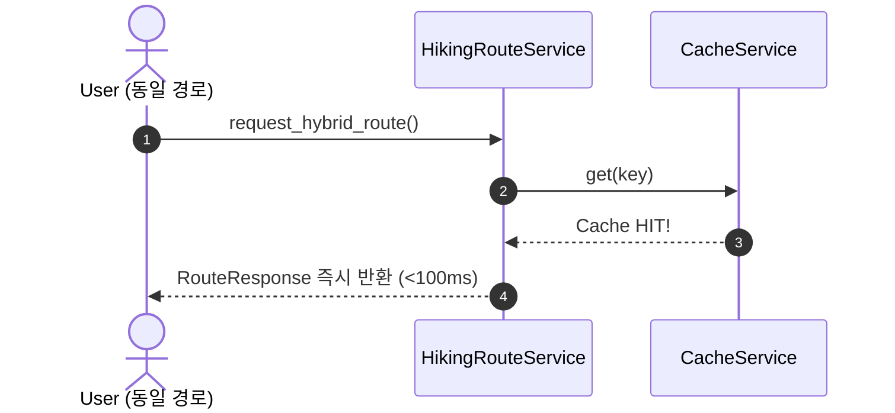
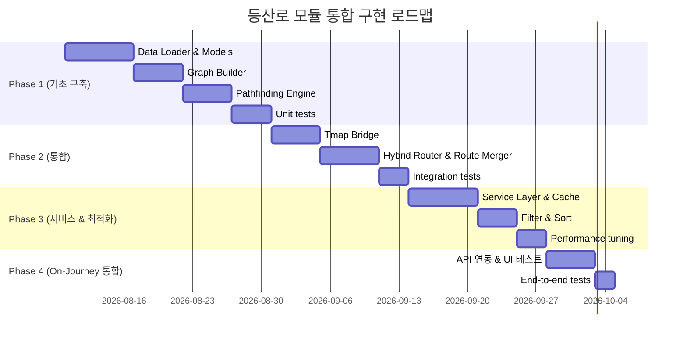

# 등산로 모듈 아키텍처 명세서
## On-Journey 프로젝트 통합 설계

---

## 1. 모듈 개요

### 1.1 목적
- 기존 Tmap 도로 경로 + 등산로 경로를 통합한 하이브리드 경로 제공
- On-Journey의 다중 경로 시스템에 새로운 경로 타입 추가
- 최소한의 기존 코드 수정으로 모듈 방식 통합

### 1.2 범위
#### In Scope:
- [x] 등산로 데이터 로드 & 관리
- [x] 등산로 그래프 생성 & 최단경로 계산
- [x] Tmap + 등산로 혼합 경로 생성
- [x] 경로 필터링 (난이도, 시간)
- [x] 메타데이터 통합 (거리, 시간, 안전지점)
- [x] 응답 포맷 (기존 Route와 호환)

#### Out of Scope:
- [ ] UI 컴포넌트 (React/Vue 통합은 별도)
- [ ] 실시간 위치 추적
- [ ] 사용자 리뷰 통합
- [ ] 날씨 기반 추천

### 1.3 의존성
#### Required:
- Tmap API (기존 On-Journey 사용)
- `mountains_grouped.json` (정제된 등산로 데이터)
- Python 3.8+ (NetworkX, numpy 등)

#### Optional:
- Redis (캐싱 고도화)
- PostGIS (대규모 공간 쿼리)

---

## 2. 아키텍처 계층



### 2.1 Data Layer (데이터 계층)

#### 2.1.1 Data Loader
- **책임**: 정제된 등산로 데이터 로드 및 메모리 캐싱
- **파일**: `hiking/data/loader.py`
- **클래스**: `HikingDataLoader`
  - `load_mountains(filepath) -> dict`
  - `get_mountain(name) -> MountainData`
  - `list_mountains() -> List[str]`
  - `get_safe_spots(mountain_name) -> List[SafeSpot]`
- **특징**:
  - 초기 로드 시 모든 데이터를 메모리에 캐싱
  - 반복 호출 시 $O(1)$ 접근 속도
  - 초기 로딩 시간 ~1-2초, 이후 밀리초 단위

#### 2.1.2 Data Models (데이터 모델)
- **파일**: `hiking/models.py`
- **클래스 계층**:
  ```text
  Mountain
    ├─ name: str
    ├─ metadata: MountainMetadata
    │   ├─ total_trails: int
    │   ├─ total_safe_spots: int
    │   ├─ entrance: Coordinate
    │   ├─ exit: Coordinate
    │   └─ difficulty_range: (min, max)
    ├─ trails: List[Trail]
    └─ safe_spots: List[SafeSpot]
  
  Trail (LineString 또는 MultiLineString)
    ├─ id: str
    ├─ name: str
    ├─ coordinates: List[Coordinate]
    ├─ difficulty: str (상/중/하)
    ├─ distance: float (km)
    ├─ estimated_time: int (분)
    ├─ elevation_gain: int (m)
    └─ properties: dict (PMNTN_*)
  
  SafeSpot (Point)
    ├─ id: str
    ├─ coordinate: Coordinate
    ├─ type: str (구급함, 대피소, 휴게소, ...)
    └─ related_mountain: str
  
  Coordinate
    ├─ latitude: float
    └─ longitude: float
  ```

#### 2.1.3 Spatial Index (공간 인덱싱)
- **파일**: `hiking/spatial/indexer.py`
- **클래스**: `SpatialIndexer`
  - `build_index(mountains) -> void`
  - `find_nearest_trail_entrance(lat, lng, mountain_name) -> Trail`
  - `find_trails_in_region(bbox) -> List[Trail]`
  - `get_nearest_safe_spot(coordinate) -> SafeSpot`
- **알고리즘**: KD-tree
  - 빠른 최근접 이웃 탐색 ($O(\log n)$)
  - 특히 "가장 가까운 등산로 입구" 찾기에 유용
- **캐시**: 산별 인덱스 메모리 유지

---

### 2.2 Algorithm Layer (알고리즘 계층)

#### 2.2.1 Graph Builder (그래프 빌더)
- **책임**: 등산로를 그래프 구조로 변환
- **파일**: `hiking/graph/builder.py`
- **클래스**: `TrailGraphBuilder`
  - `build_graph(mountain_data) -> TrailGraph`
  - `add_safe_spots(graph, safe_spots) -> void`
  - `validate_graph(graph) -> ValidationReport`
- **구조**:
  ```text
  TrailGraph
    ├─ nodes: Dict[str, Node]
    │   ├─ id: str (좌표 기반 고유ID)
    │   ├─ coordinate: Coordinate
    │   ├─ type: str (entry, exit, safe_spot, junction)
    │   └─ metadata: dict
    │
    └─ edges: List[Edge]
        ├─ from_node_id: str
        ├─ to_node_id: str
        ├─ weight: float (가중치 = 예상시간 분)
        ├─ distance: float (m)
        ├─ difficulty: str
        ├─ elevation_change: int (m)
        └─ trail_id: str (출처 등산로)
  ```
- **알고리즘**:
  1. 각 Trail(LineString)의 좌표를 노드로 분해
  2. 연속된 좌표 간 엣지 생성
  3. 안전지점(SafeSpot)을 특수 노드로 추가
  4. 가중치 계산: `weight = PMNTN_MTRQ / 노드 수`
- **검증**:
  - [x] 고립된 노드 확인
  - [x] 엣지 중복 확인
  - [x] 좌표 유효성 검증
  - [x] 가중치 범위 검증

#### 2.2.2 Pathfinding Engine (경로 찾기 엔진)
- **책임**: 최단 시간/거리 경로 계산
- **파일**: `hiking/pathfinding/engine.py`
- **클래스**: `PathfindingEngine`
  - `find_shortest_path(graph, start, end, mode='time') -> Path`
  - `find_paths_by_difficulty(graph, min_diff, max_diff) -> List[Path]`
  - `estimate_travel_time(path) -> int`
- **알고리즘 선택**:
  - **Mode 1: Dijkstra (기본, 단순)**
    - 모든 노드에서 최단경로 계산
    - 복잡도: $O((V + E) \log V)$
    - 사용: 산 규모 작음 ($V < 1000$)
  - **Mode 2: A* (고도화, 빠름)**
    - 직선거리 휴리스틱 활용
    - 복잡도: $O(E)$ (최적)
    - 사용: 산 규모 큼 ($V > 1000$) - 황령산 등
    - 휴리스틱: $h(n) = \text{직선거리} \times 1.5$ (보수적 추정)
- **가중치 전략**:
  - `w(edge)` = 시간기반 (권장): $\text{weight} = \frac{\text{edge.distance}}{\text{예상속도}}$
  - **예상속도 계산**:
    - 평탄: $4.5\text{ km/h}$
    - 오르막: $2.5\text{ km/h}$ (고도보정)
    - 내리막: $3.5\text{ km/h}$
  - **난이도 반영 (선택)**:
    - $\text{weight} \times= (1 + \text{난이도팩터})$
    - 난이도팩터: 상 = 0.3, 중 = 0.1, 하 = 0
- **반환값**:
  ```text
  Path
    ├─ start: Coordinate
    ├─ end: Coordinate
    ├─ nodes: List[Node]
    ├─ edges: List[Edge]
    ├─ total_distance: float (km)
    ├─ total_time: int (분)
    ├─ elevation_gain: int (m)
    ├─ difficulty: str
    └─ safe_spots: List[SafeSpot]
  ```

#### 2.2.3 Route Merger (경로 통합 엔진)
- **책임**: 도로 + 등산로 + 도로 세 구간 병합
- **파일**: `hiking/merge/merger.py`
- **클래스**: `RouteMerger`
  - `merge_routes(road_seg1, hiking_seg, road_seg2) -> HybridRoute`
  - `validate_merge(route) -> bool`
  - `optimize_connection_points(routes) -> List[Coordinate]`
- **입력**:
  - `road_seg1`: TmapRoute (Tmap API 응답)
  - `hiking_seg`: Path (등산로 경로 찾기 결과)
  - `road_seg2`: TmapRoute (Tmap API 응답)
- **병합 프로세스**:
  1. **연결점 검증**:
     - `road_seg1.end ≈ hiking_seg.start`? (오차범위 50m)
     - `hiking_seg.end ≈ road_seg2.start`? (오차범위 50m)
     - 불일치 시: 중간 경로 자동 생성
  2. **폴리라인 병합**:
     ```python
     merged_polyline = [
         *road_seg1.polyline,
         *hiking_seg.polyline[1:],  # 중복 제거
         *road_seg2.polyline[1:]    # 중복 제거
     ]
     ```
  3. **메타데이터 통합**:
     - `total_distance = seg1.dist + hiking.dist + seg2.dist`
     - `total_time = seg1.time + hiking.time + seg2.time`
     - `segments` = `[driving, hiking, driving]`
- **반환값**:
  ```text
  HybridRoute
    ├─ polyline: List[Coordinate] (병합된 경로)
    ├─ segments: List[RouteSegment]
    ├─ total_distance: float
    ├─ total_time: int
    ├─ elevation_gain: int
    ├─ difficulty_distribution: dict (상/중/하 비율)
    └─ safe_spots_on_route: List[SafeSpot]
  ```

---

### 2.3 Integration Layer (통합 계층)

#### 2.3.1 Hybrid Router (하이브리드 라우터)
- **책임**: 전체 경로 요청 처리 (도로 + 등산로 + 도로)
- **파일**: `hiking/routing/hybrid_router.py`
- **클래스**: `HybridRouter`
  - `request_hybrid_route(req) -> HybridRouteResponse`
  - `validate_request(req) -> bool`
  - `select_optimal_route(candidates) -> HybridRoute`
- **입력 (`HybridRouteRequest`)**:
  ```text
  ├─ start_point: Coordinate
  ├─ end_point: Coordinate
  ├─ mountain_name: str
  ├─ mode: str (time | distance | balanced)
  ├─ difficulty: str (상 | 중 | 하 | all)
  ├─ min_elevation: int (optional)
  ├─ max_elevation: int (optional)
  └─ avoid_safe_spots: bool
  ```
- **라우팅 프로세스**:
  - **Step 1**: 등산로 입구/출구 결정 (산의 주요 입구 메타데이터, 사용자 난이도 반영)
  - **Step 2**: 도로 구간 1 (Tmap `route(start_point, trail_entrance)`)
  - **Step 3**: 등산로 구간 (`PathfindingEngine.find_shortest_path(graph, entrance, exit)`)
  - **Step 4**: 도로 구간 2 (Tmap `route(trail_exit, end_point)`)
  - **Step 5**: 병합 & 최적화 (`RouteMerger.merge_routes(seg1, seg2, seg3)`)
  - **Step 6**: 응답 구성 (`return HybridRouteResponse`)
- **최적화**:
  - 결과 캐싱 (동일 요청 2시간)
  - Tmap 호출 최소화 (산별 입구/출구 사전정의)
  - 병렬 처리 (Tmap 2개 API 동시 호출)

#### 2.3.2 Tmap Bridge (Tmap 브릿지)
- **책임**: Tmap API 연동 및 캐싱
- **파일**: `hiking/tmap/bridge.py`
- **클래스**: `TmapBridge`
  - `request_route(start, end, options) -> TmapRoute`
  - `cache_route(key, route) -> void`
  - `get_cached_route(key) -> TmapRoute | None`
  - `get_entrance_coordinates(mountain_name) -> List[Coordinate]`
- **특징**:
  - Tmap API 호출 래핑
  - 응답 캐싱 (Redis 또는 메모리)
  - 에러 핸들링 및 Rate limiting
- **캐시 전략**:
  - Key: `hash(start, end, mode)`
  - TTL: 2시간
  - 용량: 최대 1000개 경로
- **산별 입구/출구 (사전정의)**:
  ```python
  entrance_coords = {
      "황령산": {
          "main": [129.078, 35.146],
          "alternative": [[129.080, 35.147], ...]
      },
      ...
  }
  ```

#### 2.3.3 Metadata Manager (메타데이터 관리)
- **책임**: 경로 메타데이터 통합 및 캐싱
- **파일**: `hiking/metadata/manager.py`
- **클래스**: `MetadataManager`
  - `compute_route_metadata(hybrid_route) -> RouteMetadata`
  - `aggregate_statistics(route) -> Statistics`
  - `cache_metadata(key, metadata) -> void`
- **메타데이터**:
  ```text
  RouteMetadata
    ├─ total_distance: float (km)
    ├─ total_time: int (분)
    ├─ elevation_summary:
    │   ├─ total_gain: int (m)
    │   ├─ total_loss: int (m)
    │   └─ max_altitude: int (m)
    ├─ difficulty_breakdown:
    │   ├─ easy_ratio: float (%)
    │   ├─ medium_ratio: float (%)
    │   └─ hard_ratio: float (%)
    ├─ segment_breakdown: [
    │   {type: 'driving', dist: 2.1, time: 12, ...},
    │   {type: 'hiking', dist: 8.4, time: 160, ...},
    │   {...}
    │ ]
    ├─ safe_spots_count: int
    └─ estimated_energy_burn: int (kcal, 선택)
  ```

---

### 2.4 Service Layer (서비스 계층)

#### 2.4.1 Hiking Route Service (하이킹 경로 서비스)
- **책임**: 비즈니스 로직 구현 및 요청 처리
- **파일**: `hiking/services/hiking_route_service.py`
- **클래스**: `HikingRouteService`
  - `request_route(req) -> RouteResponse`
  - `list_popular_routes(mountain_name) -> List[Route]`
  - `get_route_recommendations(user_profile) -> List[Route]`
- **공개 인터페이스**:
  ```python
  def request_route(
      start: Coordinate,
      end: Coordinate,
      mountain_name: str,
      mode: str = 'balanced',
      difficulty: str = 'all'
  ) -> RouteResponse:
      """
      하이브리드 경로 요청 (On-Journey에서 호출)
      """
  ```

#### 2.4.2 Filter & Sort Service (필터링 & 정렬 서비스)
- **책임**: 경로 필터링 및 정렬
- **파일**: `hiking/services/filter_service.py`
- **클래스**: `FilterSortService`
  - `filter_routes(routes, filters) -> List[Route]`
  - `sort_routes(routes, criteria) -> List[Route]`
  - `apply_user_preferences(routes, profile) -> List[Route]`
- **필터 조건**:
  - `difficulty`: 상/중/하
  - `time_range`: (min, max) 분
  - `elevation_range`: (min, max) m
  - `distance_range`: (min, max) km
  - `has_safe_spots`: bool
- **정렬 기준**:
  - `time_ascending` (가장 빠른 경로)
  - `difficulty_ascending` (가장 쉬운 경로)
  - `elevation_ascending` (가장 평탄한 경로)
  - `popularity` (사용자 리뷰 기반, 향후)
  - `custom` (사용자 프로필 기반)

#### 2.4.3 Cache Service (캐시 관리 서비스)
- **책임**: 멀티레벨 캐싱 관리
- **파일**: `hiking/services/cache_service.py`
- **클래스**: `CacheService`
  - `get(key) -> T | None`
  - `set(key, value, ttl=3600) -> void`
  - `invalidate(pattern) -> void`
  - `stats() -> CacheStats`
- **캐시 전략**:
  - **Level 1 (메모리 캐시)**: 산별 그래프(TTL $\infty$), 경로 결과(TTL 2시간, 최대 1000개)
  - **Level 2 (파일 캐시)**: 산별 메타데이터 및 인덱스 스탠바이 (`~/.hiking_cache/`)
  - **Level 3 (Redis)**: 분산 캐시 (선택사항)

---

## 3. API 명세

### 3.1 공개 API (On-Journey에서 호출)

```python
# 1. 하이브리드 경로 요청 (가장 자주 호출)
def request_hybrid_route(
    start_lat: float,
    start_lng: float,
    end_lat: float,
    end_lng: float,
    mountain_name: str,
    mode: str = 'balanced'  # 'time' | 'distance' | 'balanced'
) -> Dict:
    """
    Returns:
    {
        "success": bool,
        "route": {
            "polyline": [[lat, lng], ...],
            "segments": [
                {
                    "type": "driving",
                    "polyline": [...],
                    "distance": float,
                    "time": int,
                    "color": "#0066FF"
                },
                {
                    "type": "hiking",
                    "polyline": [...],
                    "distance": float,
                    "time": int,
                    "color": "#00CC00",
                    "difficulty": "중",
                    "elevation_gain": 420,
                    "safe_spots": [...]
                }
            ],
            "metadata": {
                "total_distance": 12.3,
                "total_time": 195,
                "difficulty": "중",
                "elevation_gain": 420,
                "estimated_calories": 1200
            }
        },
        "error": null
    }
    """

# 2. 산별 경로 목록 조회
def list_hiking_routes(mountain_name: str) -> List[Dict]:
    """산의 모든 등산로 반환"""

# 3. 산별 메타데이터 조회
def get_mountain_info(mountain_name: str) -> Dict:
    """산 정보 (경로 개수, 난이도, 안전지점 등)"""

# 4. 산 목록 조회
def list_mountains() -> List[str]:
    """등산 가능한 모든 산 반환"""
```

### 3.2 내부 API (계층 간 통신)
- **Data Layer $\leftrightarrow$ Algorithm Layer**:
  - `TrailGraph.get_node(id)`
  - `TrailGraph.get_neighbors(node_id)`
  - `TrailGraph.get_edge_weight(from_id, to_id)`
- **Algorithm Layer $\leftrightarrow$ Integration Layer**:
  - `PathfindingEngine.find_shortest_path(graph, start, end)`
  - `RouteMerger.merge_routes(seg1, seg2, seg3)`
- **Integration Layer $\leftrightarrow$ Service Layer**:
  - `HybridRouter.route(req)`
  - `TmapBridge.get_route(start, end)`

---

## 4. 데이터 흐름 (시퀀스)

### 4.1 일반적인 경로 요청 흐름



### 4.2 캐싱 적중 흐름 (2회차 요청)


*(Tmap API 호출 0회)*

---

## 5. 에러 처리 & 폴백

| 수준 | 발생 상황 | 에러 처리 전략 |
| :--- | :--- | :--- |
| **Level 1: Validation** | 산 이름 오타, 시작/종료점 범위 이상 | 즉시 예외 발생 및 유효한 산 목록 안내 |
| **Level 2: Data** | 등산로 데이터 누락 / 안전지점 누락 | 등산로 누락 시 "경로 데이터 없음" 반환, 안전지점 누락 시 제외 후 진행 |
| **Level 3: API** | Tmap API 응답 실패 / Timeout | 최대 3회 재시도 후 기본 직선거리 경로 대체 (폴백) |
| **Level 4: Algorithm** | 경로 없음 / 최단경로 계산 실패 | "도달 불가" 응답 또는 대안 탐색 (우회 안전 경로) |

---

## 6. 성능 요구사항

| 항목 | 목표 | 우선순위 |
| :--- | :--- | :--- |
| 경로 요청 응답시간 | $< 1$초 | 필수 |
| Tmap API 호출 수 | $2$회/요청 | 필수 |
| 메모리 사용 (초기화) | $< 100$MB | 권장 |
| 캐시 적중률 | $> 70\%$ | 권장 |
| 산별 그래프 로드 | $< 100$ms | 권장 |

---

## 7. 구현 로드맵



---

## 8. 디렉토리 구조 (제안)

```text
hiking_module/
├─ __init__.py
├─ config.py (설정)
│
├─ data/
│   ├─ loader.py (Data Loader)
│   ├─ models.py (Data Models)
│   └─ mountains_grouped.json (정제된 데이터)
│
├─ spatial/
│   └─ indexer.py (Spatial Index)
│
├─ graph/
│   ├─ builder.py (Graph Builder)
│   └─ types.py (Graph 데이터 구조)
│
├─ pathfinding/
│   ├─ engine.py (Pathfinding Engine)
│   └─ algorithms.py (Dijkstra, A* 구현)
│
├─ merge/
│   └─ merger.py (Route Merger)
│
├─ tmap/
│   └─ bridge.py (Tmap Bridge)
│
├─ metadata/
│   └─ manager.py (Metadata Manager)
│
├─ routing/
│   └─ hybrid_router.py (Hybrid Router)
│
├─ services/
│   ├─ hiking_route_service.py
│   ├─ filter_service.py
│   └─ cache_service.py
│
├─ tests/
│   ├─ test_data_loader.py
│   ├─ test_graph_builder.py
│   ├─ test_pathfinding.py
│   ├─ test_integration.py
│   └─ fixtures/
│
└─ docs/
    └─ API.md (이 문서)
```
