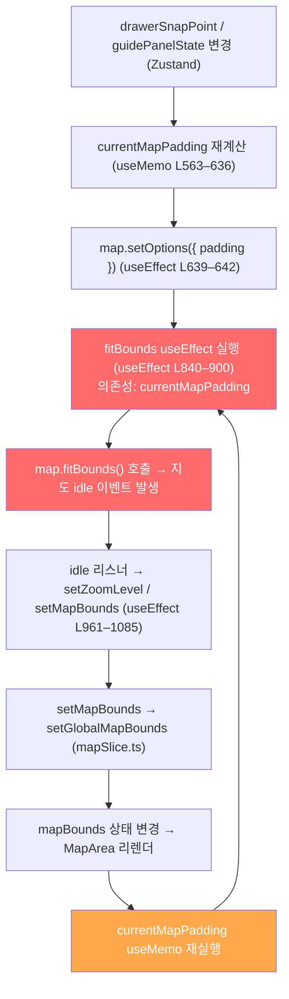

# 네이버 지도 React 통합 가이드

> 네이버 지도 API를 React 환경에서 사용할 때의 **최적화 수칙**과, 실제 프로젝트(`MapArea.tsx`)에서 발생한 **무한 루프 원인 분석 및 수정 방향**을 함께 정리합니다.

---

## Part 1. React 환경 렌더링 최적화 수칙

### 1. 지도 인스턴스 독립 — Re-render 차단

지도를 감싸는 컴포넌트가 불필요하게 다시 그려지지 않도록 상태 관리를 분리합니다.

- **`useRef` 활용:** 최초 1회 마운트 시 `new naver.maps.Map()`으로 생성한 지도 객체는 `useState`가 아닌 `useRef`에 저장하여 생명주기를 영구적으로 보존합니다.
- **명령형 업데이트:** 패딩이나 중심 좌표가 바뀔 때 컴포넌트를 리렌더링하는 대신, `useEffect` 안에서 `useRef`에 담긴 지도 인스턴스의 내장 함수를 직접 호출합니다.

### 2. UI 애니메이션과 지도 조작의 완전한 분리

동적 패딩을 매 프레임마다 계산하여 지도에 주입하면 렌더링 큐가 밀려 심각한 렉과 깜박임이 발생합니다.

- **동적 UI는 CSS로 전담:** 사이드바·바텀 시트 애니메이션은 CSS `transition` + `transform`으로 처리합니다.
- **실시간 동기화 금지:** 패널이 움직이는 시간 동안 지도 중심축을 실시간으로 맞추지 않습니다.

### 3. 타이밍 기반 오프셋 호출 패턴

복잡한 디바운스 대신 **'UI 애니메이션 종료 후 1회 호출'** 패턴을 사용합니다.

1. 사용자 인터랙션 → UI 상태 변경
2. CSS 애니메이션 실행 (예: 300ms)
3. `setTimeout(..., 300)` 또는 `onTransitionEnd` 시점에 오프셋 1회 계산
4. `map.panBy(...)` 호출

### 4. `fitBounds`를 활용한 동적 패딩 정렬

마커 그룹이 모두 보이도록 줌·중심을 동시에 조절할 때는 `fitBounds`의 margin 옵션을 활용합니다.

```typescript
// 사이드바가 열려있을 때만 left margin 추가
map.fitBounds(bounds, {
  margin: { left: isSidebarOpen ? 300 : 0, top: 50, right: 50, bottom: 50 }
});
```

---

## Part 2. `MapArea.tsx` 무한 루프 분석

> `MapArea.tsx`는 1491줄 규모의 단일 컴포넌트로, **지도 인스턴스 관리 · 상태 구독 · fitBounds/panTo 부작용**이 모두 집중되어 `useEffect` 의존성 배열 간 순환 트리거 체인이 형성됩니다.

### 핵심 루프 구조



### 개별 위험 패턴

| # | 패턴 | 위치 | 원인 |
|---|------|------|------|
| 1 | `fitBounds useEffect`의 과도한 의존성 | L900 | `currentMapPadding`이 의존성에 포함 → padding 변경마다 fitBounds 재실행 |
| 2 | `focusBounds useEffect`의 `currentMapPadding` 의존성 | L928 | padding 변경 시 focusBounds 활성 상태면 fitBounds 재실행 |
| 3 | `portalTarget` 자기참조 의존성 | L223 | MutationObserver 콜백 → `setPortalTarget` → 이펙트 재실행 → 새 Observer 등록 |
| 4 | `useJourneyDirectionsCache`의 `setTimeout(updateCache, 0)` | useDirections.ts L128 | `updateCache → setDirectionsCache → MapArea 리렌더 → places 재평가 → 구독 중복` |
| 5 | `logoControlOptions` 등의 `map` 의존성 | L502–521 | `map` 변경 시 새 객체 반환 → react-naver-maps 내부 재구성 가능성 |

### 권장 수정 방향

#### 즉시 적용 가능 (Hotfix)

```typescript
// 1. fitBounds에서 currentMapPadding을 ref로 분리
const currentMapPaddingRef = useRef(currentMapPadding);
useEffect(() => { currentMapPaddingRef.current = currentMapPadding; }, [currentMapPadding]);
// → fitBounds useEffect 의존성 배열에서 currentMapPadding 제거

// 2. portalTarget 자기참조 제거
// Before
}, [isMobile, focusedSegment, alternativeSegment, portalTarget]);
// After
}, [isMobile, focusedSegment, alternativeSegment]);
```

#### 중장기 리팩토링

| 방향 | 설명 |
|------|------|
| **MapCamera 훅 분리** | `fitBounds`, `panTo` 로직을 `useMapCamera(map, padding)` 훅으로 추출 |
| **패딩을 ref로 관리** | `currentMapPadding`을 `useRef`로 보관하여 렌더링 사이클에서 분리 |
| **idle 리스너 최적화** | `setMapBounds` 호출 전 값 변경 여부를 더 엄격하게 비교 |
| **컴포넌트 분리** | `MapArea`를 `MapCameraController`, `MapOverlays`, `MapEventHandlers`로 분리 |
