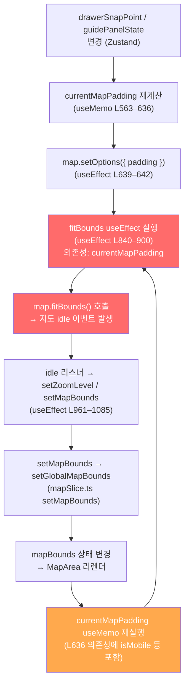

# 네이버 지도 렌더링 무한 루프 — 아키텍처 분석

## 개요

`MapArea.tsx`는 1491줄 규모의 단일 컴포넌트로, **지도 인스턴스 관리 · 상태 구독 · 부작용(fitBounds / panTo)** 이 모두 한 곳에 집중되어 있습니다.
이 구조가 여러 개의 `useEffect` 의존성 배열 간에 **순환 트리거 체인**을 만들어 무한 루프를 유발합니다.

---

## 핵심 루프 구조 (의존성 사이클)



### 루프 설명

| 단계 | 코드 위치 | 트리거 원인 |
|------|-----------|------------|
| ① `currentMapPadding` 재계산 | L563–636 `useMemo` | `drawerSnapPoint`, `guidePanelState`, `isMobile`, `windowHeight` 등 UI 상태 변경 |
| ② `map.setOptions` 실행 | L639–642 `useEffect` | `currentMapPadding` 변경 시마다 무조건 실행 |
| ③ `fitBounds useEffect` 실행 | L840–900 `useEffect` | **의존성 배열에 `currentMapPadding`이 포함**되어 padding 변경 시 재실행 |
| ④ `map.fitBounds()` 호출 | L885–888 | 지도 viewport 이동 → `idle` 이벤트 발생 |
| ⑤ `idle` 리스너 내 `setMapBounds` 호출 | L987–1015 | bounds 값이 조금이라도 바뀌면 상태 업데이트 |
| ⑥ `MapArea` 리렌더 → 다시 ① | — | Zustand 상태 변경이 구독 컴포넌트 전체 리렌더 유발 |

---

## 개별 위험 패턴 상세

### 1. `fitBounds useEffect`의 과도한 의존성 배열

```typescript
// L900 — 의존성 배열
}, [places, map, focusBounds, loadedSegmentsCount, activeJourney?.transport_type,
    currentMapPadding,          // ⚠️ 이것이 핵심 문제
    recommendedPlaces, isDrawerMaximized, isSearchMode, isMobile]);
```

`currentMapPadding`은 `useMemo`로 계산되지만, 내부적으로 참조하는 값(`drawerSnapPoint`, `windowHeight`, `guidePanelState` 등)이 **지도 조작 결과로 변경**될 수 있습니다.
결과적으로 `fitBounds → idle → 상태 변경 → currentMapPadding 재계산 → fitBounds` 루프가 형성됩니다.

### 2. `focusBounds useEffect`의 `currentMapPadding` 의존성

```typescript
// L928 — 의존성 배열
}, [focusBounds, map, currentMapPadding, isDrawerMaximized, isMobile]);
```

`currentMapPadding`이 바뀔 때마다 `focusBounds`가 활성 상태이면 **`map.fitBounds`를 다시 실행**합니다.
`lastFittedFocusBoundsRef`로 중복 실행을 막고 있지만, `currentMapPadding`이 새 객체로 생성되면 JSON 직렬화 비교값이 달라져 가드가 우회됩니다.

```typescript
// L914 — 문자열 비교
const currentFocusString = JSON.stringify(focusBounds) + `-${isMobile}-${JSON.stringify(currentMapPadding)}`;
// currentMapPadding이 수치상 동일해도 새 객체면 JSON이 동일 → 실제로는 가드가 작동함
// 그러나 padding 수치가 미세하게 바뀌면(예: windowHeight 1px 변화) 가드가 뚫림
```

### 3. `portalTarget useEffect`의 자기참조 의존성

```typescript
// L223 — 의존성 배열
}, [isMobile, focusedSegment, alternativeSegment, portalTarget]); // ⚠️ portalTarget이 의존성
```

`MutationObserver` 콜백 내에서 `setPortalTarget`을 호출하고, `portalTarget`이 의존성에 포함되어 있습니다.
DOM 변경 → `portalTarget` 갱신 → 이펙트 재실행 → 새 `MutationObserver` 등록 → DOM 변경 감지 반복의 위험이 있습니다.

### 4. `useJourneyDirectionsCache`의 `setTimeout(updateCache, 0)` 패턴

```typescript
// useDirections.ts L128
setTimeout(updateCache, 0);                    // 매 places 변경 시 즉시 실행
const unsubscribe = queryClient.getQueryCache().subscribe((event) => {
  if (isDirectionQuery) updateCache();         // 모든 directions 쿼리 갱신 시 실행
});
```

`updateCache()`가 `setDirectionsCache`를 호출하면 `MapArea`가 리렌더됩니다.
리렌더 시 `places`가 새 배열 참조로 평가될 경우 `useEffect([places, queryClient])` 가 재실행되어 다시 구독이 붙습니다 (구독 중복).
`queryClient`는 안정적인 참조이지만, **`places`는 매 렌더마다 `useMemo(() => activeJourney?.places ?? [], [activeJourney])`로 생성되어 안정적**입니다. 그러나 `activeJourney` 객체 자체가 Zustand persist에 의해 복원될 때 새 참조로 생성되면 문제가 됩니다.

### 5. `logoControlOptions` / `scaleControlOptions` / `mapDataControlOptions`의 `map` 의존성

```typescript
// L502–521
const logoControlOptions = useMemo(() => { ... }, [map]);       // ⚠️
const scaleControlOptions = useMemo(() => { ... }, [map]);      // ⚠️
const mapDataControlOptions = useMemo(() => { ... }, [map]);    // ⚠️
```

`map` 인스턴스가 변경되면 세 개의 `useMemo`가 모두 새 객체를 반환합니다.
이 값들은 `<NaverMap>` props로 전달되어 react-naver-maps가 지도를 **내부적으로 재구성**할 가능성이 있습니다.
react-naver-maps 내부가 props 변경 시 지도를 unmount/remount 한다면 `handleMapRef → setMap` → 모든 `map` 의존 이펙트 재실행의 연쇄가 발생합니다.

---

## 아키텍처 수준 근본 원인 요약

```
┌─────────────────────────────────────────────────────────┐
│                    MapArea (1491줄)                       │
│                                                           │
│  ┌──────────┐   ┌──────────────┐   ┌─────────────────┐  │
│  │ UI State │──▶│ Padding Memo │──▶│  fitBounds      │  │
│  │ (Zustand)│   │ (useMemo)    │   │  useEffect      │  │
│  └──────────┘   └──────────────┘   └────────┬────────┘  │
│       ▲                                      │           │
│       │                                      ▼           │
│  ┌────┴───────┐                    ┌─────────────────┐  │
│  │ Map Events │◀───────────────────│ map.fitBounds() │  │
│  │ (idle)     │                    └─────────────────┘  │
│  └────────────┘                                          │
│                                                           │
│  문제: "부작용이 상태를 변경하고, 그 상태가 다시 부작용을 트리거"  │
└─────────────────────────────────────────────────────────┘
```

**핵심은 단일 책임 원칙(SRP) 위반입니다.**
`MapArea`가 다음을 모두 담당합니다:
- 지도 인스턴스 라이프사이클 관리
- UI 상태 구독 (15개 이상의 상태 값)
- 지도 카메라 제어 (fitBounds, panTo)
- 마커/폴리라인 렌더링
- GPS/나침반 이벤트 처리
- DOM 조작 (MutationObserver, portal)

이 과도한 책임 집중이 **부작용 간 의존성 사이클**을 피할 수 없게 만드는 구조적 원인입니다.

---

## 권장 수정 방향

### 즉시 적용 가능한 수정 (Hotfix)

1. **`fitBounds useEffect`에서 `currentMapPadding`을 의존성 제거**
   - `currentMapPadding`은 이펙트 실행 *내부*에서 `map.setOptions`를 통해 적용되므로,
     별도 이펙트(L639–642)가 이미 처리합니다.
   - `fitBounds` 이펙트는 `places`, `focusBounds`, `loadedSegmentsCount` 변경에만 반응하면 됩니다.
   - `currentMapPadding`을 `ref`로 관리하여 의존성에서 제거:
     ```typescript
     const currentMapPaddingRef = useRef(currentMapPadding);
     useEffect(() => { currentMapPaddingRef.current = currentMapPadding; }, [currentMapPadding]);
     ```

2. **`portalTarget` 의존성 자기참조 제거**
   ```typescript
   // Before
   }, [isMobile, focusedSegment, alternativeSegment, portalTarget]);
   // After
   }, [isMobile, focusedSegment, alternativeSegment]); // portalTarget 제거
   ```

3. **`logoControlOptions` 등의 `map` 의존성 제거**
   - `map`이 아닌 `window.naver?.maps` 가용 여부만 체크하도록 수정.

### 중장기 리팩토링

| 방향 | 설명 |
|------|------|
| **MapCamera 훅 분리** | `fitBounds`, `panTo` 로직을 `useMapCamera(map, padding)` 훅으로 추출 |
| **패딩을 ref로 관리** | `currentMapPadding`을 `useRef`로 보관하여 렌더링 사이클에서 분리 |
| **idle 리스너 최적화** | `setMapBounds` 호출 전 실질적인 값 변경 여부를 더 엄격하게 비교 |
| **컴포넌트 분리** | `MapArea`를 `MapCameraController`, `MapOverlays`, `MapEventHandlers`로 분리 |
