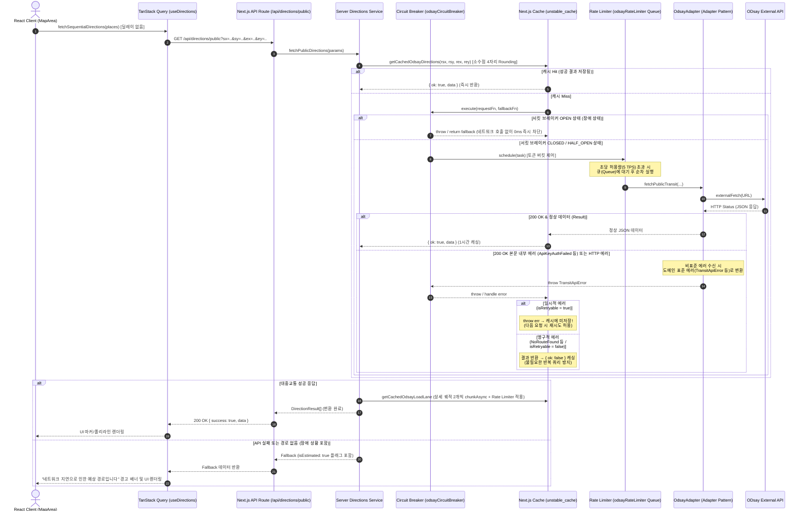

# ODsay API 호출, 서킷 브레이커 및 캐시 관리 작동 방식

OnJourney 서비스에서 ODsay API를 활용하여 대중교통 경로 데이터를 조회하고, 서버 레벨 스로틀링(Rate Limiter), 서킷 브레이커(Circuit Breaker), 표준 에러 변환 어댑터(OdsayAdapter) 및 2단계 캐싱을 처리하는 전체 작동 방식 체계입니다.

---

## 1. 전체 아키텍처 및 데이터 흐름



---

## 2. 2단계 캐시 및 서킷 브레이커/어댑터 흐름 (Cache & Fault Tolerance)

ODsay API의 비표준 에러 및 서버 장애 전파를 방지하기 위해 **어댑터 패턴** 및 **서킷 브레이커** 계층이 유기적으로 동작합니다.

```mermaid
flowchart TD
    Start([ODsay API 요청 발생]) --> CacheCheck{unstable_cache<br/>캐시 존재 여부}
    
    CacheCheck -- Hit (성공 결과) --> ReturnCached[저장된 경로 데이터 즉시 반환]
    CacheCheck -- Miss --> CBCheck{서킷 브레이커 상태?}

    CBCheck -- OPEN (차단) --> FastFallback[외부 호출 우회 - Fail-Fast<br/>즉시 Fallback 반환]
    CBCheck -- CLOSED / HALF_OPEN --> RLAcquire{Rate Limiter<br/>토큰 획득?}

    RLAcquire -- 대기 필요 --> RLQueue[메시지 큐 대기] --> RLAcquire
    RLAcquire -- 획득 성공 --> CallAdapter[OdsayAdapter 실행]

    CallAdapter --> HttpFetch[externalFetch 실행]
    HttpFetch --> CheckFake200{HTTP 200 OK &<br/>본문 내 에러 유무?}

    CheckFake200 -- 에러 발견 (ApiKeyAuthFailed 등) --> ThrowCustomError[표준 Custom Error 변환 및 throw<br/>TransitAuthError 등]
    CheckFake200 -- 정상 데이터 --> SaveSuccessCache[Next.js 캐시에 1시간 저장<br/>{ ok: true, data }]

    ThrowCustomError --> CBUpdate[Circuit Breaker 실패 횟수 기록]
    CBUpdate --> CheckRetry{isRetryable === true?}
    
    CheckRetry -- Yes (일시 오류 / 서킷 오픈) --> BypassCache[캐시에 에러 저장 안 됨<br/>다음 쿼리 시 재시도 가능]
    CheckRetry -- No (영구 오류 / NoRouteFound) --> SaveFailCache[캐시에 { ok: false } 1시간 저장<br/>중복 어뷰징 방지]

    SaveSuccessCache --> End([정상 응답 반환])
    BypassCache --> FastFallback
    SaveFailCache --> FastFallback
```

### 아키텍처 핵심 컴포넌트 규격 요약

| 컴포넌트 | 적용 패턴/알고리즘 | 설정치 및 기준 | 기대 효과 |
|---|---|---|---|
| **ServerRateLimiter** | Token Bucket + Request Queue | 최대 5 TPS, 초당 5개 리필 | 클라이언트의 취약한 150ms 딜레이를 제거하고, 서버 단에서 안전하게 외부 요청 트래픽을 통제 및 대기 처리. |
| **CircuitBreaker** | State Machine (Closed/Open/Half-Open) | 연속 3회 실패 시 OPEN, 쿨다운 10초 | 외부 서비스 연속 장애 시 300ms/600ms 동기식 딜레이 대기를 즉시 끊고(Fail-Fast), 서버 커넥션 고갈 차단. |
| **OdsayAdapter** | Adapter Pattern | 표준 Custom Error 변환 | 외부 API 비표준 `200 OK` 에러 본문을 분석하여 도메인 표준 예외 객체로 격리 변환(Decoupling). |
| **Coordinate Rounding** | 격자 정규화 | 소수점 4자리 반올림 (약 11m 격자) | 미세 GPS 차이로 발생하는 캐시 파편화를 방지하고 캐시 히트율 극대화. |
| **Fallback UX** | Graceful Degradation | `isEstimated: true` 플래그 반환 | API 호출 실패 시에도 하버사인 산출 경로를 반환하되, 클라이언트에 추산치임을 고지하여 경고 UI 가시화. |

---

## 3. 동시성 제어 및 트래픽 분배 (Throttling System)

1. **클라이언트 딜레이 제거**: 기존의 클라이언트 측 구간 요청 간 150ms 인위적 딜레이는 보안 및 통제에 취약하여 **완전히 제거**되었습니다. 클라이언트는 지연 없이 모든 구간 경로를 서버에 즉시 질의합니다.
2. **서버 측 큐잉 (Queueing)**: 다중 사용자 요청이 몰려 외부 API 임계값을 초과하는 시점이 오더라도, 서버에 구현된 `ServerRateLimiter` 메시지 큐에 의해 외부 호출 속도가 5 TPS 이내로 엄격히 평활화(Smoothing)되어 나갑니다.
3. **서버 상세 노선 조회 (`chunkAsync`)**: ODsay 상세 궤적 노선(`loadLane`)을 가져올 때는 서버 내부적으로 2개씩 병렬 청크 단위로 분할 실행하며, 매 청크 역시 `odsayRateLimiter` 큐를 통과하므로 동시성 관리가 완벽히 적용됩니다.
