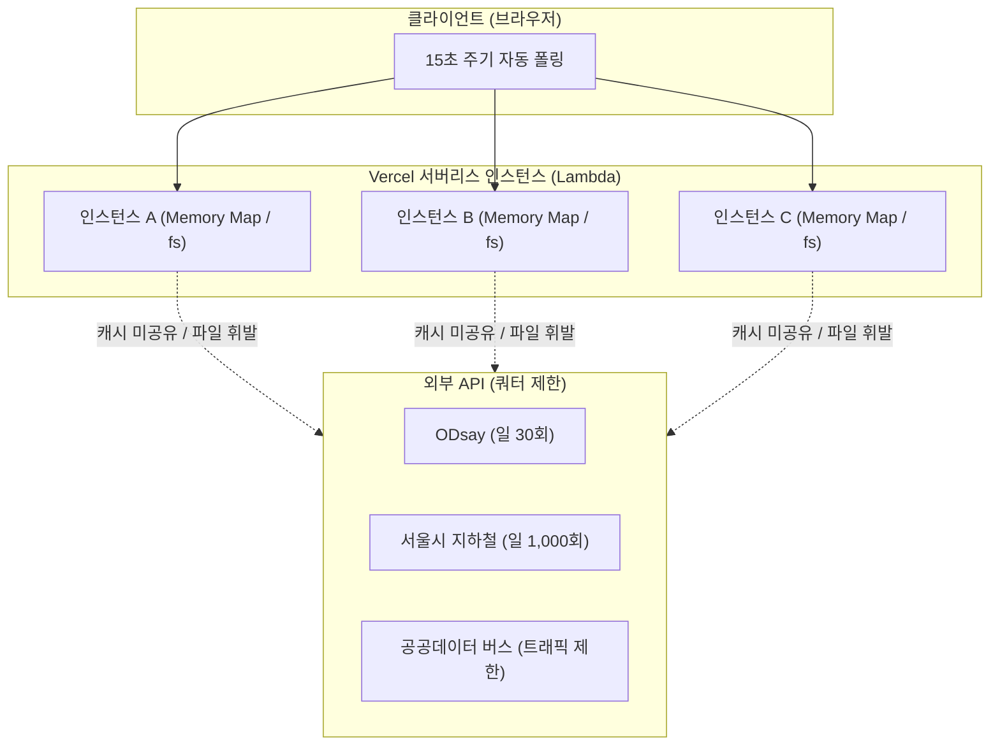
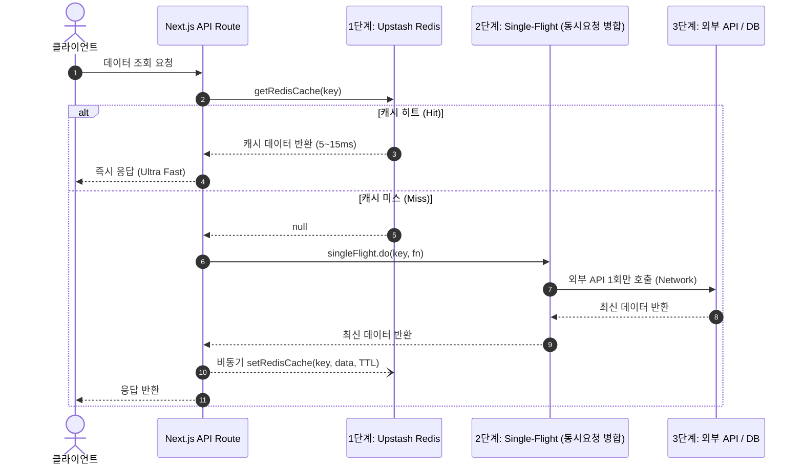

# Redis 분산 캐시 전수검사 및 확장 로드맵 보고서

> **문서 상태**: 검토 완료 (구현 대기)  
> **작성일자**: 2026-09-16  
> **관련 인프라**: Upstash Redis REST (`@upstash/redis`), Next.js 16 App Router (Vercel Serverless)  
> **관련 모듈**: `src/lib/infrastructure/redisClient.ts`, `src/lib/infrastructure/subwayCacheService.ts`

---

## 1. 개요 및 분석 배경

OnJourney 서비스는 서울시 지하철 실시간 일괄 도착 및 열차 위치 조회의 안정성과 속도 개선을 위해 **Upstash Redis 분산 캐시(`redisClient.ts`)**를 최초로 도입했습니다.

본 보고서는 Redis 도입 이전에 구현되어 **로컬 인메모리(`LruTtlCache`, `Map`)**, **로컬 디스크 파일시스템(`fs`)**, 또는 **캐시가 누락(`cache: 'no-store'`)**되어 있던 프로젝트 전반의 API 호출 및 데이터 쿼리 파이프라인을 **전수검사(Full-Audit)**하고, 향후 Redis 캐시로 확장 전환하기 위한 기술 분석 및 로드맵을 제공합니다.

---

## 2. 기존 캐시 방식의 4가지 한계 분석

Next.js App Router 기반의 서버리스 환경(Vercel Functions 등)에서 기존 방식들이 가졌던 근본적 한계는 다음과 같습니다:



1. **로컬 파일 시스템 (`fs.promises.writeFile / fs.readFileSync`) 의존**:
   - `data/cache/` 디렉터리에 JSON으로 영속화를 시도함 (`busRoutePersistentCache.ts`, `intercityRouteCache.ts`, `odsayQuotaGuard.ts`).
   - **문제**: 서버리스 환경은 Ephemeral(임시) 파일시스템이므로 인스턴스가 종료/재시작되면 캐시가 증발하며, 다중 인스턴스 간에 캐시가 공유되지 않습니다.
2. **단일 프로세스 인메모리 (`LruTtlCache` / `Map`) 의존**:
   - Node.js 힙 메모리에 캐시를 유지 (`TagoBusService.ts`, `GyeonggiBusService.ts`, `BusanBusService.ts`, `busPositionService.ts`).
   - **문제**: 사용자의 요청이 다른 서버리스 워커 인스턴스로 분산될 때마다 캐시 미스가 발생하여 외부 공공 API를 중복 호출합니다.
3. **Next.js `unstable_cache`의 제약**:
   - Next.js 내부 캐시 계층에만 의존할 경우 Redis와 같은 글로벌 키 패턴 검색(`scan`), 세밀한 분산 원자적 연산(`INCR`), 실시간 관리자 일괄 파기가 어렵습니다.
4. **실시간 API 캐시 누락 (`cache: 'no-store'`)**:
   - 단일 역 실시간 지하철 도착 조회(`subwayRealtimeService.ts`), 인천/대전 버스 실시간 도착 조회가 캐시 없이 외부 API를 직접 타격하고 있었습니다.

---

## 3. Redis 도입 대상 전수조사 결과 매트릭스

### 🔴 P0 (최우선/긴급): 쿼터 고갈 방지 및 서버리스 영속화 결함 해소

| 대상 도메인 및 파일 | 기존 방식 | 한계 및 위험성 | Redis 적용 방안 및 키 설계 | 권장 TTL |
| :--- | :--- | :--- | :--- | :--- |
| **ODsay 일일 쿼터 관리자**<br>`src/lib/infrastructure/odsayQuotaGuard.ts` | 로컬 파일<br>(`data/cache/odsay/daily_quota.json`) | 인스턴스마다 카운트가 분리되어 실제 30회 쿼터를 초과, 429 Quota Exceeded 발생 | `odsay:quota:{YYYY-MM-DD}`<br>Redis `INCR` 원자적 카운팅 | 매일 KST 자정 만료 (`EXPIREAT`) |
| **버스 정적 정류소 영속 캐시**<br>`src/lib/infrastructure/busRoutePersistentCache.ts` | 로컬 파일 (`data/cache/bus-routes/*.json`) + `Map` | 100~200개 정류소 목록을 30일 보관하려 했으나 인스턴스 종료 시 파일이 날아가 공공 API 재호출 | `bus:route-stations:{key}`<br>Redis 분산 캐시로 완전 영속화 | 30일 |
| **시외/장거리 경로 2주 캐시**<br>`src/lib/infrastructure/intercityRouteCache.ts` | 로컬 파일 (`data/cache/intercity-routes/*.json`) + `Map` | ODsay 30회 쿼터 방어를 위한 14일 영속 캐시이나 서버리스 배포/재시작 시 전멸 | `intercity:route:{hash}`<br>Redis 글로벌 14일 영구 보존 | 14일 |
| **단일 역 지하철 실시간 도착**<br>`src/lib/services/subwayRealtimeService.ts`<br>(`/api/subway/realtime`) | **캐시 없음**<br>(`cache: 'no-store'`) | 클라이언트가 15초마다 자동 갱신할 때 서울시 API(일 1,000회 한도)를 직접 타격 | `subway:station-arrivals:{station}`<br>15초 글로벌 분산 캐싱 | 15초 |

---

### 🟡 P1 (중요): 전국 버스 실시간 위치 및 메타데이터 분산화

| 대상 도메인 및 파일 | 기존 방식 | 한계 및 위험성 | Redis 적용 방안 및 키 설계 | 권장 TTL |
| :--- | :--- | :--- | :--- | :--- |
| **실시간 버스 위치**<br>`src/lib/services/busPositionService.ts`<br>`src/lib/transit/BusanBusService.ts` | `LruTtlCache` (인메모리 30초/15초) | 동일 노선을 여러 사용자가 볼 때 인스턴스마다 공공 버스 위치 API 중복 호출 | `bus:positions:{routeId}`<br>지하철 위치와 동일한 다계층 캐시 | 15~30초 |
| **전국 버스 정류소/노선 ID 매핑**<br>`src/lib/transit/TagoBusService.ts`<br>`src/lib/transit/GyeonggiBusService.ts`<br>`src/lib/transit/BusanBusService.ts` | `LruTtlCache` (인메모리 24시간) | 인스턴스 생성 시마다 공공데이터 XML API 검색을 재수행하여 1~3초 응답 지연 초래 | `bus:meta:node:{key}`<br>`bus:meta:route:{key}` | 7일~30일 |
| **지자체 실시간 버스 도착**<br>`src/lib/transit/IncheonBusService.ts`<br>`src/lib/transit/DaejeonBusService.ts` | **캐시 없음** (`cache: 'no-store'`) | 실시간 도착 정보 폴링 시 지자체 버스 API에 과부하 발생 위험 | `bus:arrivals:{region}:{stationId}` | 15초 |

---

### 🟢 P2 (권장): 길찾기 다계층 고도화 및 DB 풀스캔 방지

| 대상 도메인 및 파일 | 기존 방식 | 한계 및 위험성 | Redis 적용 방안 및 키 설계 | 권장 TTL |
| :--- | :--- | :--- | :--- | :--- |
| **ODsay 지하철 시간표/역ID**<br>`src/lib/services/subway/timetableService.ts` | `LruTtlCache` (인메모리 3시간/24시간) | 인스턴스 재시작 시 ODsay 시간표 및 역 검색 API를 재호출하여 쿼터 소모 | `subway:odsay:station:{name}`<br>`subway:timetable:{stationId}:{way}` | 역ID: 30일<br>시간표: 12시간 |
| **대전 도시철도 전체 시간표**<br>`src/lib/services/daejeonSubwayService.ts` | 모듈 전역 변수 `timetableCache` (인메모리 12시간) | 서버리스 람다 인스턴스별로 공공데이터포털 대전 시각표 API 호출 | `subway:daejeon:timetable` | 12시간 |
| **대중교통/도보 길찾기 결과**<br>`kakaoTransitService.ts`<br>`publicTransitService.ts`<br>`odsayWalkingService.ts` | `unstable_cache` (Next.js 로컬 1시간) | 카카오(1,000회), ODsay(30회) 쿼터를 서버리스 인스턴스 간 완벽히 공유하지 못함 | `directions:transit:{sx}:{sy}:{ex}:{ey}:{time}`<br>`directions:walk:{sx}:{sy}:{ex}:{ey}` | 대중교통: 1시간<br>도보: 24시간 |
| **인기 장소 DB 풀스캔 완화**<br>`src/lib/services/placesService.ts` | `unstable_cache` (10분), Supabase `journeys.places` 풀스캔 | 여정이 늘어날수록 JSON 컬럼 풀스캔 비용 증가 및 콜드 스타트 시 DB 쿼리 지연 | `places:popularity-counts` | 30분~1시간 |
| **관리자 온디맨드 무효화**<br>`src/app/api/admin/revalidate/route.ts` | Next.js `revalidateTag`만 지원 | Redis 캐시 및 메모리 캐시는 수동 초기화 불가능 | 관리자 토큰 인증 후 Redis 키 패턴(`subway:*`, `bus:*`) 일괄 삭제 기능 추가 | 즉시 반영 |

---

## 4. Redis 키 네이밍 규격 및 아키텍처 패턴

### 4.1 표준 네이밍 규칙
```
[도메인] : [하위도메인] : [주요식별자] : [보조식별자]
```
- 모든 키는 소문자와 콜론(`:`) 구분자를 사용합니다.
- 좌표가 포함되는 경우 소수점 4자리(약 11m 해상도)로 반올림하여 캐시 적중률(Hit Ratio)을 극대화합니다.

### 4.2 권장 3단계 다계층 캐시 아키텍처
`subwayCacheService.ts`에서 검증된 구조를 표준 패턴으로 정립합니다:



---

## 5. 단계별 실행 로드맵

### Phase 1: 쿼터 방어 및 데이터 유실 방지 (P0 영역)
1. **`odsayQuotaGuard.ts` Redis 전환**:
   - 로컬 파일 쓰기 제거.
   - Redis `INCR` 및 자정 만료로 분산 환경 안전 쿼터 보장.
2. **`subwayRealtimeService.ts` 단일역 캐싱**:
   - `subway:station-arrivals:{station}` 15초 Redis 캐시 추가.
3. **영속 캐시 파일시스템 의존 제거**:
   - `busRoutePersistentCache.ts` 및 `intercityRouteCache.ts` 내부 스토리지를 Redis로 교체.

### Phase 2: 버스 및 지하철 메타데이터 분산화 (P1 & 일부 P2 영역)
1. **버스 실시간 위치 및 도착 정보 Redis 캐싱**:
   - `busPositionService.ts` 및 `RealtimeTransitService.ts`에 15초 TTL 분산 캐시 적용.
2. **전국 버스 정류소/노선 ID 매핑 영속화**:
   - `TagoBusService.ts`, `GyeonggiBusService.ts`, `BusanBusService.ts`의 ID 캐시를 Redis로 이전.
3. **ODsay 지하철 시간표 및 대전 지하철 시간표 분산화**:
   - `timetableService.ts`, `daejeonSubwayService.ts`에 Redis 적용.

### Phase 3: 길찾기 파이프라인 및 관리 도구 고도화 (P2 잔여 영역)
1. **길찾기 서비스 다계층 캐시 표준화**:
   - `kakaoTransitService.ts`, `publicTransitService.ts`, `odsayWalkingService.ts`에 Redis 1차 캐시 도입.
2. **장소 인기도 집계 캐싱**:
   - `placesService.ts`의 `popularity-counts`를 Redis로 전환하여 Supabase DB 부하 절감.
3. **관리자 온디맨드 캐시 무효화 API 확장**:
   - `/api/admin/revalidate`에 Redis 키 패턴 삭제 파라미터 추가.

---

## 6. 예상 정량적 효과

| 지표 | 기존 상태 | Redis 확장 적용 후 (예상) |
| :--- | :--- | :--- |
| **ODsay 일일 쿼터 초과율** | 람다 인스턴스 분립으로 간헐적 429 에러 발생 | 글로벌 원자적 카운터로 **0% (100% 방어)** |
| **서울시 지하철 API 호출수** | 15초 폴링 시 사용자 수에 비례하여 선형 증가 | 동일 역 조회 시 15초간 1회로 압축 (**90% 이상 절감**) |
| **공공데이터 버스 정류소 응답속도**| 콜드 스타트 시 1.5초~3초 | Redis 캐시 히트 시 **10ms~20ms (100배 이상 단축)** |
| **서버리스 배포 시 캐시 지속성**| 인스턴스 재배포 시 100% 증발 | Upstash Redis 클라우드에 **100% 안전 보존** |
| **Supabase DB 풀스캔 빈도** | 인스턴스 콜드 스타트마다 JSON 풀스캔 | 30분~1시간 주기 1회로 대폭 감소 |
