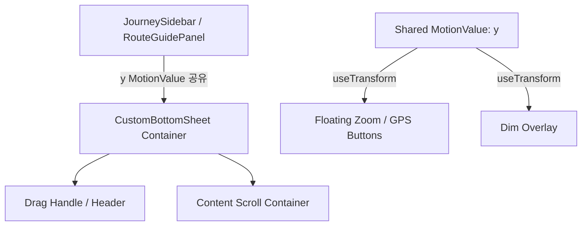

# Framer Motion 기반 커스텀 바텀 시트 아키텍처 설계서

이 아키텍처 설계서는 과거 커스텀 바텀 시트 구현 시 겪으셨을 버그들의 원인을 분석하고, [바텀 시트 요구사항](file:///C:/Users/hitsz/.gemini/antigravity-ide/brain/ce32fdb6-49dc-4010-85cb-113ab719828d/bottom_sheet_requirements.md)을 완벽하게 만족시키기 위해 Framer Motion을 활용한 구조적 해결 방안을 제시합니다.

---

## 1. 과거 커스텀 구현 시 발생했을 버그 원인 분석 및 해결 방안

### Bug A. 스크롤 영역과 드래그 영역의 상호 충돌 (Scroll vs Drag)
* **원인**: 바텀 시트 내부 컨텐츠가 길어 스크롤(`overflow-y: auto`)이 생길 때, 사용자가 리스트를 스크롤하려고 아래로 내리면 시트 전체가 아래로 끌려 내려가거나, 반대로 시트를 내리려고 하는데 내부 리스트만 스크롤되는 현상.
* **Framer Motion 해결책**:
  - **드래그 핸들 전용 영역 분리**: 바텀 시트 전체에 드래그를 걸지 않고, 상단 헤더/핸들 바 영역에만 드래그 권한을 줍니다. `<motion.div drag="y" dragControls={dragControls}>`를 사용하여, 오직 핸들이나 헤더를 잡고 드래그할 때만 시트가 움직이게 제어합니다.
  - **컨텐츠 내부 스크롤 이벤트 격리**: 컨텐츠 영역에서의 터치 제스처는 스크롤 이벤트가 우선하도록 설정하고, 시트가 '최대 높이(Full Screen)' 상태이며 스크롤 위치가 최상단(`scrollTop === 0`)일 때 아래로 드래그하는 특수한 경우에만 드래그 제어권을 시트로 부드럽게 넘겨받도록 스크롤 이벤트 리스너를 결합합니다.

### Bug B. 관성 및 빠른 쓸어내리기(Swipe/Flick) 감지 미흡
* **원인**: 단순히 손가락을 뗀 시점의 시트 위치(Y 좌표)만 계산하여 다음 스냅 위치를 결정할 경우, 사용자가 시트를 위나 아래로 빠르게 튕겼을 때(Swipe) 시트가 원래 위치로 되돌아가 버려 뻑뻑하고 답답한 느낌을 줌.
* **Framer Motion 해결책**:
  - `onDragEnd` 이벤트에서 제공하는 `info.velocity.y` (손을 뗄 때의 속도 px/s)를 활용합니다.
  - 만약 속도가 일정 임계값(예: 500px/s)을 초과하면, 현재 위치와 상관없이 던진 방향(위/아래)의 다음 스냅 포인트로 즉시 넘어가도록 물리 수식을 계산합니다.

### Bug C. 가상 키보드 및 화면 리사이즈 시 높이 깨짐 (Responsive Height Breakdown)
* **원인**: 바텀 시트의 스냅 포인트를 하드코딩된 절대 픽셀(px)값으로 지정하면, 모바일 가상 키보드가 올라와 뷰포트 높이가 줄어들거나 기기를 회전할 때 시트가 화면 위로 튀어나가거나 완전히 묻혀버리는 현상.
* **Framer Motion 해결책**:
  - 스냅 포인트(Snap Points)를 계산할 때, 동적으로 뷰포트 높이(`window.innerHeight`)를 반영하는 반응형 상태값 또는 CSS Custom Property(`--vh`)와 연동합니다.
  - Framer Motion의 `y` 축 제어 값을 절대 좌표가 아닌 **"화면 하단으로부터의 오프셋"** 혹은 **"최대 높이 대비 비율"**로 환산하여 반응형으로 움직이도록 구조화합니다.

---

## 2. 구체적인 컴포넌트 아키텍처 설계



### A. Shared Motion Value 구조
`react-modal-sheet`와 달리, 우리는 Framer Motion의 `y` (또는 `dragY`) `MotionValue`를 컴포넌트 최상단에서 직접 생성하여 하위로 주입하거나 context로 공유합니다.

* **동기화 원리**:
  ```tsx
  const y = useMotionValue(0);
  
  // y 좌표(translateY)에 따라 플로팅 버튼의 투명도를 실시간으로 매핑 (딜레이 0ms)
  // 예: 최소 높이(210px) 상태에 도달하면 투명도 1.0, 위로 올라갈수록 투명도 0.0
  const buttonsOpacity = useTransform(y, [minY, defaultY], [1, 0]);
  const buttonsY = useTransform(y, [minY, defaultY], [0, -50]); // 버튼도 시트 위치에 맞춰 자연스럽게 슬라이딩
  ```

### B. 단단한 벽 (Hard Clamp Constraint) 설계
사용자의 제스처로 절대 최소 높이 아래로 시트가 내려가지 못하게 물리 장벽을 세웁니다.

```tsx
// dragConstraints의 bottom을 최소 높이 스냅 포인트에 해당하는 Y값으로 강력하게 묶어버림
// elastic을 0으로 주면, 아래로 내리려고 할 때 탄성 조차 없이 딱딱하게 멈춥니다.
<motion.div
  drag="y"
  dragMomentum={true}
  dragElastic={{ top: 0.1, bottom: 0 }} // 아래 방향 탄성은 0으로 설정하여 물리적 벽 형성
  dragConstraints={{
    top: -maxHeightValue, // 최대 확장 높이
    bottom: -minHeightValue // 최소 유지 높이 (이하로 드래그 불가!)
  }}
  style={{ y }}
  onDragEnd={handleDragEnd}
>
```

### C. 프로그래밍 방식의 닫기 (isOpen과의 연동)
사용자가 드래그로는 닫을 수 없지만, `focusedSegment`가 세팅되는 등의 시스템적인 닫기 요청 시에는 화면 아래 0px(화면 밖)으로 닫혀야 합니다.

- **원리**: `dragConstraints`의 아래쪽 한계선은 평소에는 `-minHeight`로 막혀 있지만, `isOpen === false`가 되는 순간 `dragConstraints` 제한을 풀거나 애니메이션 컨트롤러(`useAnimation`)를 통해 직접 `animate({ y: 0 })`을 트리거하여 210px 장벽을 뚫고 화면 밖으로 깔끔하게 퇴장시킵니다.

---

## 3. 검증 및 스냅 계산 유틸리티 (`getSnapTarget`)

`onDragEnd` 시점에 동작 및 속도를 고려하여 사용자가 의도한 최적의 스냅 위치를 계산하는 유틸리티 함수 구조입니다.

```typescript
interface SnapPoint {
  y: number;      // translateY 값 (예: -210, -360, -window.innerHeight)
  name: 'min' | 'default' | 'max';
}

export function getSnapTarget(
  currentY: number, 
  velocityY: number, 
  snapPoints: SnapPoint[]
): SnapPoint {
  const VELOCITY_THRESHOLD = 500; // 스와이프 판정 속도 (px/s)
  
  // 1. 빠른 스와이프 다운
  if (velocityY > VELOCITY_THRESHOLD) {
    // 현재 Y값보다 아래에 있는(Y값이 더 큰) 스냅 포인트 중 가장 가까운 곳 선택
    return snapPoints.find(p => p.y > currentY) || snapPoints[0];
  }
  
  // 2. 빠른 스와이프 업
  if (velocityY < -VELOCITY_THRESHOLD) {
    // 현재 Y값보다 위에 있는(Y값이 더 작은) 스냅 포인트 중 가장 가까운 곳 선택
    return snapPoints.find(p => p.y < currentY) || snapPoints[snapPoints.length - 1];
  }
  
  // 3. 느린 드래그 (단순 거리 기준 가장 가까운 스냅 포인트)
  return snapPoints.reduce((prev, curr) => 
    Math.abs(curr.y - currentY) < Math.abs(prev.y - currentY) ? curr : prev
  );
}
```
