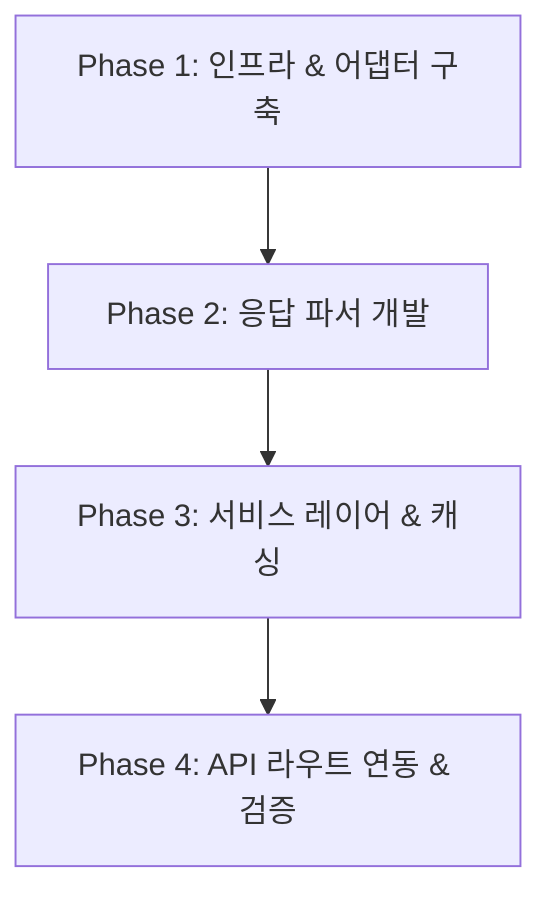

# 카카오 대중교통 REST API 전환 가이드 및 작업 계획서

## 1. 개요 및 배경

### 1.1 배경 및 목적
* **ODsay 쿼터 축소**: 일 1,000회에서 30회로 급감하여 개발/테스트 및 운영 불가.
* **TMAP 쿼터 한계**: TMAP 대중교통 API 무료 일일 쿼터가 10회로 제한되어 실질적 도입 불가.
* **카카오 대중교통 API 도입**:
  * 엔드포인트: `GET https://dapi.kakao.com/v2/routing/publictraffic`
  * **일일 무료 쿼터: 1,000회** 제공 (기존 키 `KAKAO_REST_API_KEY` 재활용 가능).
  * 버스/지하철/환승 정보 및 **중간 환승 도보 궤적(Polyline) 100% 기본 포함**.
  * 별도의 궤적 API(`loadLane`) 호출이 불필요하여 1회 요청으로 렌더링 준비 완료.

### 1.2 카카오 대중교통 API 특성 및 유의사항
* **장점**:
  * 호출 1회당 대중교통 노선 + 환승 보행로 + 정류장 목록 + 실시간 상세 위경도 궤적(`[[x, y], ...]`) 일괄 반환.
  * 이미 프로젝트에 세팅된 카카오 인증 인프라(`Authorization: KakaoAK ...`) 그대로 사용.
* **한계 및 대응**:
  * **장거리 여객철도(KTX/SRT) 미지원**: 수도권 및 대도시 시내/광역 교통 위주로 설계되어 도 경계를 넘는 초장거리 이동 시 `NO_RESULTS` 반환.
  * **대응 전략**: `NO_RESULTS` 수신 시 프론트엔드에 시외 이동 안내 메시지 표시 및 자가용(Car) 경로 전환 권장 UX 제공.

---

## 2. 아키텍처 및 데이터 흐름

### 2.1 API 호출 흐름 변화
```
[기존: ODsay]
Client -> /api/directions/public -> serverDirectionsService -> publicTransitService
       -> OdsayAdapter (maasRP) + [추가 loadLane N회] -> maasRPParser -> DirectionResult[]

[신규: Kakao]
Client -> /api/directions/public -> serverDirectionsService -> kakaoTransitService
       -> KakaoAdapter (publictraffic 1회) -> kakaoTransitParser -> DirectionResult[]
```

### 2.2 데이터 모델 매핑 명세 (`Kakao Route` -> `DirectionResult`)

| 카카오 필드 (`Route / Step`) | OnJourney 표준 필드 (`DirectionResult / SubPath`) | 변환 방식 / 비고 |
| :--- | :--- | :--- |
| `properties.totalTime` (초) | `totalTime` (분) | `Math.round(totalTime / 60)` |
| `properties.totalDistance` (m) | `totalDistance` (m) | 1:1 매핑 |
| `properties.transfers` | `transferCount` | 1:1 매핑 |
| `properties.fare.value` | `payment` | 요금 원 단위 매핑 (기본값 0) |
| `properties.type` | `pathType` | `BUS` -> 2, `SUBWAY` -> 1, `BUS_AND_SUBWAY` -> 3 |
| `steps[].properties.type` | `subPath.trafficType` | `WALKING` -> 3, `BUS` -> 2, `SUBWAY` -> 1 |
| `steps[].properties.guidance` | `subPath.sectionName` / 안내 | 안내 텍스트 |
| `steps[].properties.stops` | `subPath.passStopList` | 정류장 이름 목록 파싱 |
| `steps[].properties.vehicles` | `subPath.lane` | 노선 번호, 버스 타입, 노선 색상 매핑 |
| `steps[].path.points` | `subPath.pathCoordinates` | `[x, y]` 배열 -> `{ lat: y, lng: x }[]` 변환 |

---

## 3. 단계별 마이그레이션 작업 계획



### Phase 1: 카카오 대중교통 인프라 어댑터 구축
* **대상 파일**: `src/lib/infrastructure/kakaoTransitAdapter.ts` (신규)
* **주요 작업**:
  1. `KakaoTransitAdapter.fetchPublicTraffic(sx, sy, ex, ey, sName?, eName?)` 구현
  2. `Authorization: KakaoAK ${process.env.KAKAO_REST_API_KEY}` 헤더 인증 처리
  3. 카카오 에러 응답(`INVALID_REQUEST`, `STARTNODES_NULL` 등) 정규화 예외 클래스 처리
  4. 쿼터 보호를 위한 RateLimiter 및 CircuitBreaker 호환 래핑 (선택적)

### Phase 2: 카카오 응답 전용 파서 (Parser) 개발
* **대상 파일**: `src/lib/services/directions/transit/kakaoTransitParser.ts` (신규)
* **주요 작업**:
  1. `parseKakaoTransitResponse(data, sx, sy, ex, ey): DirectionResult[]` 함수 구현
  2. **궤적 좌표 변환**:
     - `step.path.points` (`[[lon, lat], ...]`)를 OnJourney의 `{ lat, lng }[]` 배열로 변환
  3. **노선 색상 및 메타데이터 매핑**:
     - 버스 세부 타입(`간선`, `지선`, `광역`, `마을` 등)에 맞춘 Tailwind 색상 코드 자동 매핑 (`transitColorUtils` 활용)
     - 지하철 노선명 정규화 (예: `수인분당선` 색상 매핑)
  4. **문전 도보 보정 (Door-to-Door)**:
     - 출발지 ↔ 첫 정류장, 마지막 정류장 ↔ 도착지 간 도보 연결 처리

### Phase 3: 서비스 레이어 구현 및 캐싱(Caching) 적용
* **대상 파일**: `src/lib/services/directions/transit/kakaoTransitService.ts` (신규)
* **주요 작업**:
  1. `fetchKakaoTransitOptions(sx, sy, ex, ey, departureTime?)` 함수 구현
  2. **Next.js `unstable_cache` 적용**:
     - 캐시 키: `['kakao-transit-v1', roundCoord(sx), roundCoord(sy), roundCoord(ex), roundCoord(ey)]`
     - revalidate: 3600초 (1시간)
     - 쿼터(1,000회) 절약을 위한 동일 구간 중복 호출 원천 차단
  3. `NO_RESULTS` 처리:
     - 장거리/결과 없음 시 빈 배열 `[]` 안전 반환 및 로깅

### Phase 4: 파사드(Facade) 교체 및 API 라우트 연동
* **대상 파일**:
  - `src/lib/services/serverDirectionsService.ts`
  - `src/lib/services/directions/transit/publicTransitService.ts`
* **주요 작업**:
  1. `serverDirectionsService.ts`의 `fetchPublicDirections` 내부 호출을 `kakaoTransitService`로 교체
  2. 기존 ODsay 관련 코드는 레거시(Fallback)로 보존하거나 안전하게 스위칭할 수 있도록 구성
  3. `/api/directions/public` API 라우트 동작 확인

### Phase 5: 통합 테스트 및 회귀 검증
* **검증 시나리오**:
  1. **수도권 시내 환승**: 동탄 CGV ↔ 기흥역 수인분당선 (버스+지하철 복합, 환승 도보 폴리라인 검증)
  2. **단일 수단**: 서울역 ↔ 수원역 (지하철 1호선 단일 경로 검증)
  3. **도보 포함 검증**: 중간 환승 보행 궤적이 지도 화면에 끊김 없이 렌더링되는지 확인
  4. **결과 없음(Fallback)**: 수원역 ↔ 부산역 등 초장거리 경로 시 UI 깨짐 없이 적절한 안내가 노출되는지 확인

---

## 4. 파일 변경 목록 요약

| 구분 | 파일 경로 | 설명 |
| :---: | :--- | :--- |
| **신규** | `src/lib/infrastructure/kakaoTransitAdapter.ts` | 카카오 대중교통 REST API 통신 어댑터 |
| **신규** | `src/lib/services/directions/transit/kakaoTransitParser.ts` | 카카오 JSON -> `DirectionResult` 변환 파서 |
| **신규** | `src/lib/services/directions/transit/kakaoTransitService.ts` | 캐싱 및 에러 핸들링이 적용된 메인 서비스 |
| **수정** | `src/lib/services/serverDirectionsService.ts` | 공개 API export 진입점을 카카오 서비스로 연결 |
| **보존** | `src/lib/infrastructure/odsayAdapter.ts` 등 기존 ODsay 파일 | 필요 시 Fallback 또는 추후 복구용으로 유지 |
