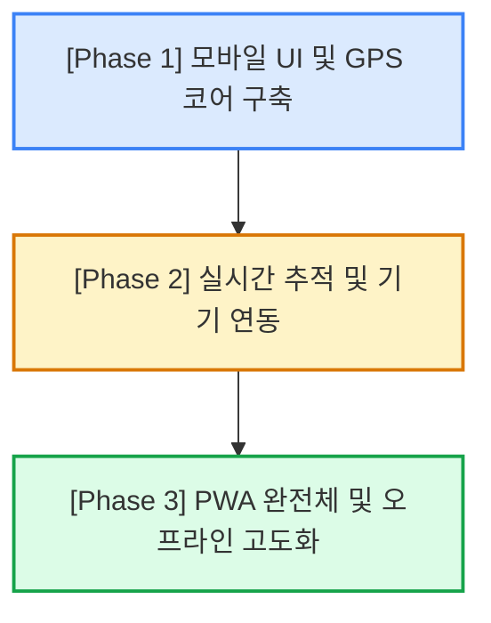

# 모바일 환경 최적화 및 PWA 연동 기술 로드맵

본 문서는 온저니(On-Journey) 다중 경유지 경로 최적화 서비스의 모바일 웹 성능 극대화 및 PWA(Progressive Web App) 연동을 위한 구체적인 UX 설계 및 기술 스펙 로드맵입니다.

---

## 1. 개요 및 목표

*   **배경**: 현재 OnJourney는 데스크톱 중심의 넓은 화면(좌측 고정 사이드바, 우측 전체 지도) 레이아웃을 기반으로 구축되었습니다. 이를 모바일 환경(스마트폰 터치/제스처)에 이식하고, 실제 이동 환경에서 실시간 정보를 부드럽게 받아볼 수 있도록 네이티브 앱 급의 UX를 실현하는 것이 목표입니다.
*   **핵심 방향성**: 
    1.  **모바일 친화적 레이아웃 개편** (사이드바 ➔ 바텀 시트)
    2.  **하드웨어 및 OS API 연동** (GPS 위치 추적, 진동 알림, 웹 푸시)
    3.  **실시간 모니터링 시스템 구축** (실시간 이동 정보 및 경유역 추적)
    4.  **오프라인 가용성 확보** (PWA 서비스 워커, 데이터 캐싱)

---

## 2. 모바일 특화 UX 개선 전략

### 📱 2.1 스와이프 가능한 바텀 시트 (Swipeable Bottom Sheet)
데스크톱의 `JourneySidebar` 및 `RouteGuidePanel`을 모바일 최적화 레이아웃으로 개편합니다.
*   **구현 방향**:
    *   화면 아래에서 위로 쓸어 올리는 동작에 대응하는 터치 제스처 라이브러리(예: `vaul` 또는 CSS Translate 터치 이벤트 직접 구현) 연동.
    *   **3단계 높이 제어**:
        1.  *Min (축소)*: 지도 뷰포트를 최대로 확보하며, 하단에 콤팩트한 '재생 바(컨트롤러)' 혹은 '현재 여정 진행률'만 표시.
        2.  *Mid (기본)*: 지도 하단 30~45%를 차지하며, '다음 경유지 정보'와 '핵심 경로 안내' 요약 표시.
        3.  *Max (확장)*: 전체 화면을 덮으며, 전체 경유지 리스트 및 상세 step-by-step 타임라인 표시.

### 🛰️ 2.2 Geolocation API 기반 실시간 내 위치 추적 (Active Tracking)
사용자의 위치 변화를 실시간으로 인지하여 지도를 움직여주는 자동 추적 모드입니다.
*   **구현 방향**:
    *   `navigator.geolocation.watchPosition`을 사용하여 사용자 실시간 위경도 좌표 감지.
    *   지도의 중심(Center)을 사용자 위치와 목적지를 모두 포함하는 적절한 경계상자(Bounds)로 동적 피팅하거나, 사용자 마커를 중앙에 고정(헤딩 방향 회전 포함).
    *   **자동 단계 전환**: 사용자의 현재 GPS 좌표가 현재 경로 안내 단계(Step)의 `endLat`, `endLng`(하차/도착지) 반경 30m 이내로 진입 시, 수동 조작 없이 컨트롤러의 단계를 다음 단계로 자동 갱신.

### 📳 2.3 진동 API (Vibration API) 활용 하차 알림
모바일 디바이스의 물리적인 피드백을 통해 하차 알림을 전송합니다.
*   **구현 방향**:
    *   사용자 위치가 목적지(또는 환승 정류장) 반경 100m~200m(대중교통 속도 고려) 내에 위치하거나, 실시간 대중교통 API 상에서 하차 정류장 1정거장 전 임이 감지될 때 동작.
    *   `window.navigator.vibrate([500, 200, 500, 200, 800])` 함수를 사용하여 강하고 명확한 진동 피드백 전달.

---

## 3. 실시간 정보 제공 및 컨트롤러 고도화

### 📂 3.1 경유 정류장 아코디언 UI 및 이동 시각화
탑승/하차 지점 사이에 생략된 수많은 경유 정류장을 펼쳐보고 추적할 수 있도록 합니다.
*   **구현 방향**:
    *   상세 경로 가이드 내 대중교통 단계 아래에 `[N개 정류장 이동]` 영역을 클릭 가능한 아코디언 컴포넌트(Collapsible)로 구현.
    *   아코디언 확장 시 상세 정류장 이름 목록과 통과 상태 표시.
    *   실시간 대중교통 API(BIS, 서울시 실시간 지하철 등)를 15~30초 주기로 폴링하여, 경유 정류장 타임라인 선 위에서 이동 수단 아이콘(🚌, 🚇)이 지나가고 있는 지점을 실시간으로 그리는 동적 매핑 구현.

### ⚠️ 3.2 실시간 우회 경로 및 대안 노선 스위칭
이동 중 돌발 상황(지하철 대형 지연, 도로 통제, 버스 놓침 등) 발생 시 능동적으로 대처합니다.
*   **구현 방향**:
    *   서버(BFF)에서 실시간으로 버스/지하철 도착 정보를 조회하며 비정상적인 지연(예: 배차 간격 20분 이상 지연) 감지 시 클라이언트에 경고 전송.
    *   화면에 토스트(Toast) 메시지 노출: *"현재 이용 예정인 150번 버스가 15분 이상 지연되고 있습니다. 택시 또는 지하철 대안 노선으로 변경하시겠습니까?"*
    *   `[변경하기]` 클릭 시 `AlternativeRoutePanel`을 즉시 호출하고, 변경 확정 시 기존 여정 스토어(`journey-store`)의 `selected_route`를 실시간 업데이트하여 지도 폴리라인 재렌더링.

---

## 4. PWA(Progressive Web App) 기술 연동 요소

### 📦 4.1 오프라인 가용성 (Service Worker & Cache API)
이동 중 터널, 지하철 지하 구간 등 네트워크가 불안정한 음영 지역에서도 서비스가 중단되지 않도록 합니다.
*   **구현 방향**:
    *   `next-pwa` 플러그인 또는 수동 Service Worker 파일을 빌드 시 생성하여 핵심 정적 자산(CSS, JS, Web Font 등) 캐싱.
    *   네이버 지도 API 라이브러리 스크립트 및 기본 타일 이미지를 런타임 캐싱 정책(Stale-While-Revalidate)으로 처리하여 오프라인 상태에서도 지도가 최소한의 캐시 데이터로 그려지도록 설정.
    *   **Zustand 상태 로컬 백업**: 오프라인 전환 시 API 요청 대신 IndexedDB 혹은 LocalStorage에 저장해 둔 임시 캐시 데이터를 로드하여 여정을 계속 읽을 수 있도록 조치.

### 🔔 4.2 백그라운드 푸시 알림 (Push API & Notification API)
스마트폰 화면이 꺼져 있거나 웹 브라우저를 백그라운드로 내렸을 때도 중요한 환승/하차 정보를 수신합니다.
*   **구현 방향**:
    *   Service Worker의 `push` 이벤트 리스너 등록.
    *   서버(BFF)에서 GPS 좌표 분석 또는 대중교통 실시간 API를 추적하다가 중요한 트리거 지점이 감지되면 웹 푸시 서버를 통해 디바이스로 알림 전송.
    *   알림 배너 클릭 시 OnJourney 앱으로 포커스 이동 및 현재 진행 단계 줌인.

---

## 5. 단계별 구현 로드맵

### 1단계 (Phase 1): 모바일 UI 및 GPS 코어 구축 (단기)
*   [ ] 스와이프형 바텀 시트 레이아웃 설계 및 기존 모달 4종 모바일 최적화 여백 조정.
*   [ ] Geolocation API 연동 및 내 위치 마커 표시, 지도 center 이동 기능 구현.
*   [ ] 경로 상세 안내의 경유 정류장 아코디언 UI 추가.

### 2단계 (Phase 2): 실시간 추적 및 기기 연동 (중기)
*   [ ] Geolocation 기반 하차 거리 연산 및 진동 API(`vibrate`) 트리거 연동.
*   [ ] 실시간 API 데이터를 경유 정류장 타임라인 상에 매핑하여 버스/지하철 실시간 위치 가시화.
*   [ ] 배차 지연 시 대안 노선 제안 토스트 및 스위칭 로직 연동.

### 3단계 (Phase 3): PWA 완전체 및 오프라인 고도화 (장기)
*   [ ] PWA Manifest 파일 설정 및 앱 아이콘 설정.
*   [ ] Next.js 빌드 시 PWA Service Worker 활성화 및 오프라인 캐싱 구축.
*   [ ] 백그라운드 하차 알림용 웹 푸시 알림 인프라 및 서버 연동.

---

## 6. GPS/Geolocation 기능 상세 실행 계획 (보류 중)

본 계획은 사용자가 GPS 연동 기능을 활성화하여 현재 위치를 탐색하고 여정에 추가할 수 있도록 설계된 상세 스펙입니다.

### 6.1 UI/UX 구성 요소 및 스펙
1.  **플로팅 GPS 버튼 (`MapArea.tsx`)**:
    *   **위치**: 지도 우측 하단의 "전체 보기" 버튼 바로 위 영역.
    *   **디자인**: 흰색 배경(유리 효과 블러 포함)의 둥근 모서리 사각형 혹은 원형 디자인, 중앙 조준선(lucide/target 등) 아이콘 표시.
    *   **동작**: 
        *   클릭 시 로딩 스피너 작동 및 버튼 비활성화 (다중 클릭 방지).
        *   `navigator.geolocation.getCurrentPosition`을 호출해 좌표 획득 후 지도를 해당 중심 위치로 부드럽게 이동 (`map.panTo`).
2.  **슬릭 펄싱 마커 (Pulsing Marker)**:
    *   **디자인**: 짙은 파란색 코어 도트 주변에 파란색 반투명 링이 점점 퍼지며 사라지는 무한 애니메이션 효과 적용.
    *   **CSS 설정**: `@keyframes gpsPulse` 및 `@utility animate-gps-pulse` 추가.
3.  **현재 위치 상세 정보 카드 (Quick Add Card)**:
    *   **디자인**: 화면 하단 좌측 오버레이 형태로 노출 (기존 추천 장소 상세 카드 레이아웃과 일관성 유지).
    *   **기능**:
        *   네이버 지도 Geocoder 서브모듈의 `reverseGeocode`를 연동하여 좌표 기준 도로명/지번 주소 실시간 파싱 및 화면 표시.
        *   `[여정에 추가]` 버튼을 통해 해당 좌표를 `id: 'gps-' + Date.now()` 형식의 `Place` 객체로 생성해 스토어(`journey-store` 내 `addPlace`)에 즉시 추가.
        *   이미 추가된 경우 `[여정에서 제거]`로 토글 및 삭제 기능 지원.

### 6.2 구현 대상 파일 및 작업 내용
*   `src/app/globals.css`: 펄싱 파동 무한 애니메이션 키프레임 정의.
*   `src/components/MapArea.tsx`: Geolocation 연동 로직, 버튼 UI 마운트, 실시간 reverseGeocode 및 추가 오버레이 카드 UI 구현.
*   `src/components/sidebar/SearchOverlay.tsx`: 필요 시 검색창 최상단에 '현재 위치 기준 검색' 숏컷 추가 연동.

